<div align="center">

# 🏗️ System Architecture

**Classroom Quick Downloader — Engineering Deep-Dive**

> 「質は細部に宿る」
> *Quality resides in the details.*

---


</div>

---

## 📋 Table of Contents

1. [Executive Engineering Summary](#-executive-engineering-summary)
2. [System Modeling & Diagrams](#-system-modeling--diagrams)
3. [Data Flow Architecture](#-data-flow-architecture)
4. [Technical Rationale](#-technical-rationale)
5. [Reliability & Security](#-reliability--security)
6. [Performance Characteristics](#-performance-characteristics)

---

## 🎯 Executive Engineering Summary

### The Problem: From Misery to Mastery

> **The Misery:** Thousands of browser extension users generating concurrent analytics events, all targeting a single SQLite database on a Free Tier ARM64 VM.

> **The Mastery:** A globally-distributed edge buffer that aggregates, deduplicates, and batches events before they ever reach the origin—reducing write pressure by **99%**.

### The Core Challenge

```
┌─────────────────────────────────────────────────────────────────────────────┐
│                           THE WRITE AMPLIFICATION PROBLEM                    │
├─────────────────────────────────────────────────────────────────────────────┤
│                                                                              │
│   ❌ NAIVE APPROACH                    ✅ CQD APPROACH                       │
│   ─────────────────                    ──────────────                        │
│                                                                              │
│   10,000 users                         10,000 users                          │
│       ↓                                    ↓                                 │
│   10,000 HTTP requests/hour            10,000 events buffered at edge        │
│       ↓                                    ↓                                 │
│   10,000 SQLite INSERTs                1 aggregated batch                    │
│       ↓                                    ↓                                 │
│   💥 Database locks                    ✅ 1 SQLite INSERT                    │
│   💥 Connection exhaustion                                                   │
│   💥 $$$$ Bandwidth costs                                                    │
│                                                                              │
└─────────────────────────────────────────────────────────────────────────────┘
```

### Architectural Principles


| Principle                      | Implementation                                                    |
| ------------------------------ | ----------------------------------------------------------------- |
| **Edge-First Processing**      | Cloudflare Workers handle ingestion at 300+ global locations      |
| **Strong Consistency**         | Durable Objects provide single-threaded event processing          |
| **Pre-Aggregation**            | Counters computed at edge, not at origin                          |
| **Idempotent Writes**          | Batch IDs ensure exactly-once delivery                            |
| **Zero External Dependencies** | Go binary + SQLite = No Redis, No Postgres, No connection pooling |

---

## 🔷 System Modeling & Diagrams

### 1. Logical Architecture — Monorepo Structure

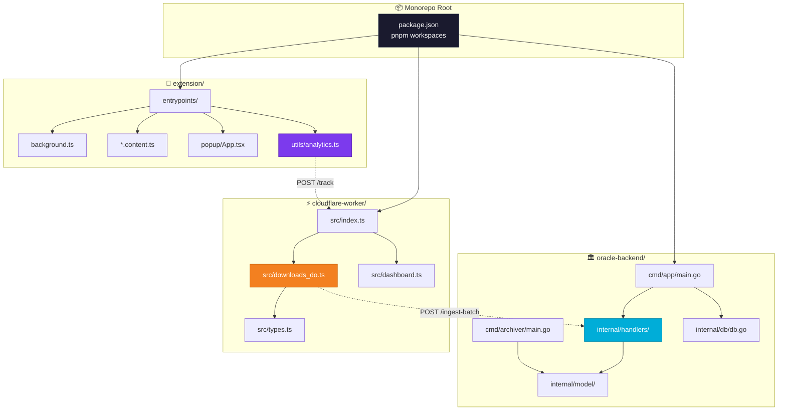
```mermaid
graph TD
    subgraph "📦 Monorepo Root"
        PKG[package.json<br/>pnpm workspaces]
    end

    subgraph "🧩 extension/"
        EXT_ENTRY[entrypoints/]
        EXT_BG[background.ts]
        EXT_CONTENT[*.content.ts]
        EXT_POPUP[popup/App.tsx]
        EXT_ANALYTICS[utils/analytics.ts]
      
        EXT_ENTRY --> EXT_BG
        EXT_ENTRY --> EXT_CONTENT
        EXT_ENTRY --> EXT_POPUP
        EXT_ENTRY --> EXT_ANALYTICS
    end

    subgraph "⚡ cloudflare-worker/"
        CF_INDEX[src/index.ts]
        CF_DO[src/downloads_do.ts]
        CF_TYPES[src/types.ts]
        CF_DASH[src/dashboard.ts]
      
        CF_INDEX --> CF_DO
        CF_INDEX --> CF_DASH
        CF_DO --> CF_TYPES
    end

    subgraph "🏛️ oracle-backend/"
        GO_MAIN[cmd/app/main.go]
        GO_ARCH[cmd/archiver/main.go]
        GO_HANDLERS[internal/handlers/]
        GO_DB[internal/db/db.go]
        GO_MODEL[internal/model/]
      
        GO_MAIN --> GO_HANDLERS
        GO_MAIN --> GO_DB
        GO_HANDLERS --> GO_MODEL
        GO_ARCH --> GO_MODEL
    end

    PKG --> EXT_ENTRY
    PKG --> CF_INDEX
    PKG --> GO_MAIN

    EXT_ANALYTICS -.->|POST /track| CF_INDEX
    CF_DO -.->|POST /ingest-batch| GO_HANDLERS

    style PKG fill:#1a1a2e,stroke:#16213e,color:#fff
    style EXT_ANALYTICS fill:#7C3AED,stroke:#5B21B6,color:#fff
    style CF_DO fill:#F38020,stroke:#C65D00,color:#fff
    style GO_HANDLERS fill:#00ADD8,stroke:#0088A8,color:#fff
```

---

### 2. Service Boundaries & Responsibilities

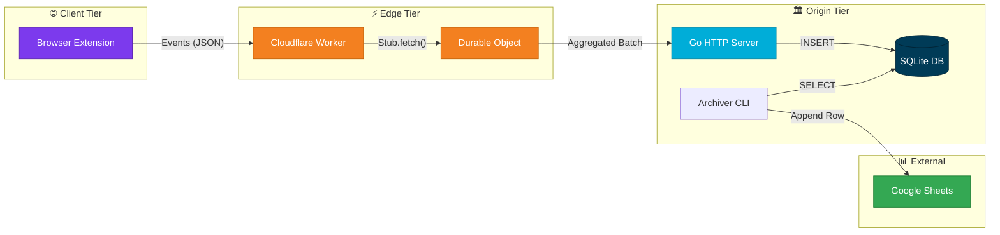
```mermaid
graph LR
    subgraph "🌐 Client Tier"
        A[Browser Extension]
    end

    subgraph "⚡ Edge Tier"
        B[Cloudflare Worker]
        C[Durable Object]
    end

    subgraph "🏛️ Origin Tier"
        D[Go HTTP Server]
        E[(SQLite DB)]
        F[Archiver CLI]
    end

    subgraph "📊 External"
        G[Google Sheets]
    end

    A -->|"Events (JSON)"| B
    B -->|"Stub.fetch()"| C
    C -->|"Aggregated Batch"| D
    D -->|"INSERT"| E
    F -->|"SELECT"| E
    F -->|"Append Row"| G

    style A fill:#7C3AED,stroke:#5B21B6,color:#fff
    style B fill:#F38020,stroke:#C65D00,color:#fff
    style C fill:#F38020,stroke:#C65D00,color:#fff
    style D fill:#00ADD8,stroke:#0088A8,color:#fff
    style E fill:#003B57,stroke:#002233,color:#fff
    style G fill:#34A853,stroke:#1E7E34,color:#fff
```

---

### 3. The Ingestion Sequence — Full Event Lifecycle

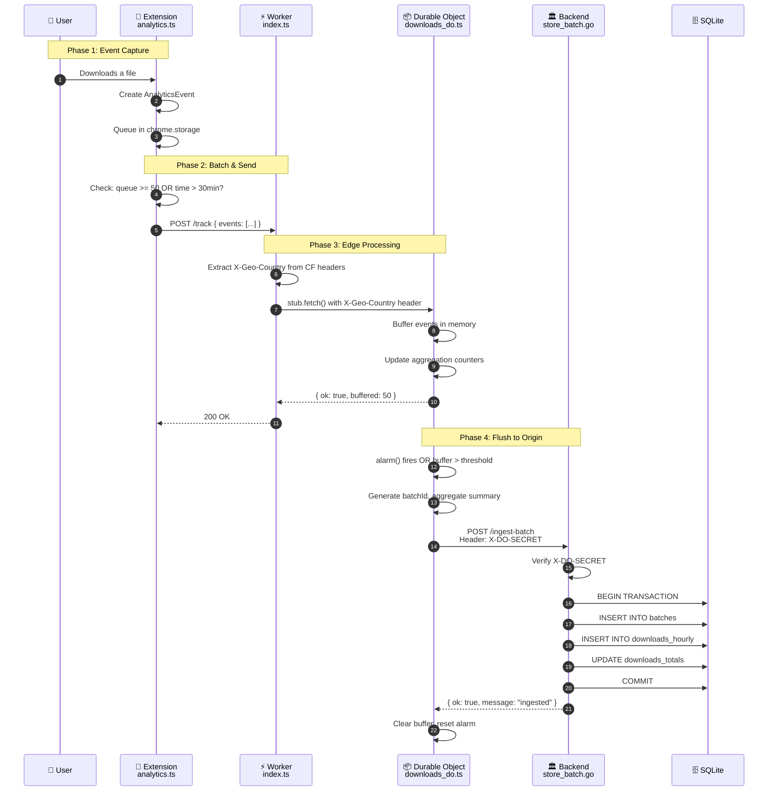
```mermaid
sequenceDiagram
    autonumber
    participant User as 👤 User
    participant Ext as 🧩 Extension<br/>analytics.ts
    participant Worker as ⚡ Worker<br/>index.ts
    participant DO as 📦 Durable Object<br/>downloads_do.ts
    participant Backend as 🏛️ Backend<br/>store_batch.go
    participant DB as 🗄️ SQLite

    Note over User,Ext: Phase 1: Event Capture
    User->>Ext: Downloads a file
    Ext->>Ext: Create AnalyticsEvent
    Ext->>Ext: Queue in chrome.storage

    Note over Ext,Worker: Phase 2: Batch & Send
    Ext->>Ext: Check: queue >= 50 OR time > 30min?
    Ext->>Worker: POST /track { events: [...] }
  
    Note over Worker,DO: Phase 3: Edge Processing
    Worker->>Worker: Extract X-Geo-Country from CF headers
    Worker->>DO: stub.fetch() with X-Geo-Country header
    DO->>DO: Buffer events in memory
    DO->>DO: Update aggregation counters
    DO-->>Worker: { ok: true, buffered: 50 }
    Worker-->>Ext: 200 OK

    Note over DO,Backend: Phase 4: Flush to Origin
    DO->>DO: alarm() fires OR buffer > threshold
    DO->>DO: Generate batchId, aggregate summary
    DO->>Backend: POST /ingest-batch<br/>Header: X-DO-SECRET
    Backend->>Backend: Verify X-DO-SECRET
    Backend->>DB: BEGIN TRANSACTION
    Backend->>DB: INSERT INTO batches
    Backend->>DB: INSERT INTO downloads_hourly
    Backend->>DB: UPDATE downloads_totals
    Backend->>DB: COMMIT
    Backend-->>DO: { ok: true, message: "ingested" }
    DO->>DO: Clear buffer, reset alarm
```

---

### 4. Data Structure Model — TypeScript ↔ Go Mapping

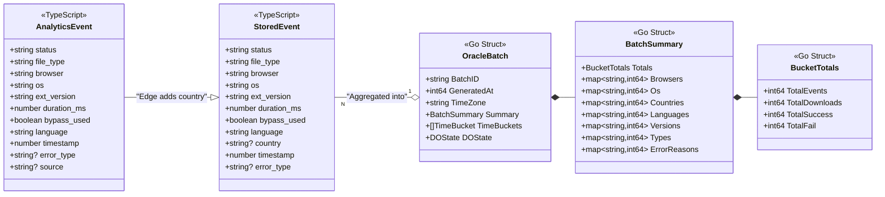
```mermaid
classDiagram
    direction LR

    class AnalyticsEvent {
        <<TypeScript>>
        +string status
        +string file_type
        +string browser
        +string os
        +string ext_version
        +number duration_ms
        +boolean bypass_used
        +string language
        +number timestamp
        +string? error_type
        +string? source
    }

    class StoredEvent {
        <<TypeScript>>
        +string status
        +string file_type
        +string browser
        +string os
        +string ext_version
        +number duration_ms
        +boolean bypass_used
        +string language
        +string? country
        +number timestamp
        +string? error_type
    }

    class OracleBatch {
        <<Go Struct>>
        +string BatchID
        +int64 GeneratedAt
        +string TimeZone
        +BatchSummary Summary
        +[]TimeBucket TimeBuckets
        +DOState DOState
    }

    class BatchSummary {
        <<Go Struct>>
        +BucketTotals Totals
        +map~string,int64~ Browsers
        +map~string,int64~ Os
        +map~string,int64~ Countries
        +map~string,int64~ Languages
        +map~string,int64~ Versions
        +map~string,int64~ Types
        +map~string,int64~ ErrorReasons
    }

    class BucketTotals {
        <<Go Struct>>
        +int64 TotalEvents
        +int64 TotalDownloads
        +int64 TotalSuccess
        +int64 TotalFail
    }

    AnalyticsEvent --|> StoredEvent : "Edge adds country"
    StoredEvent "N" --o "1" OracleBatch : "Aggregated into"
    OracleBatch *-- BatchSummary
    BatchSummary *-- BucketTotals
```

---

### 5. Database Schema — Entity Relationship

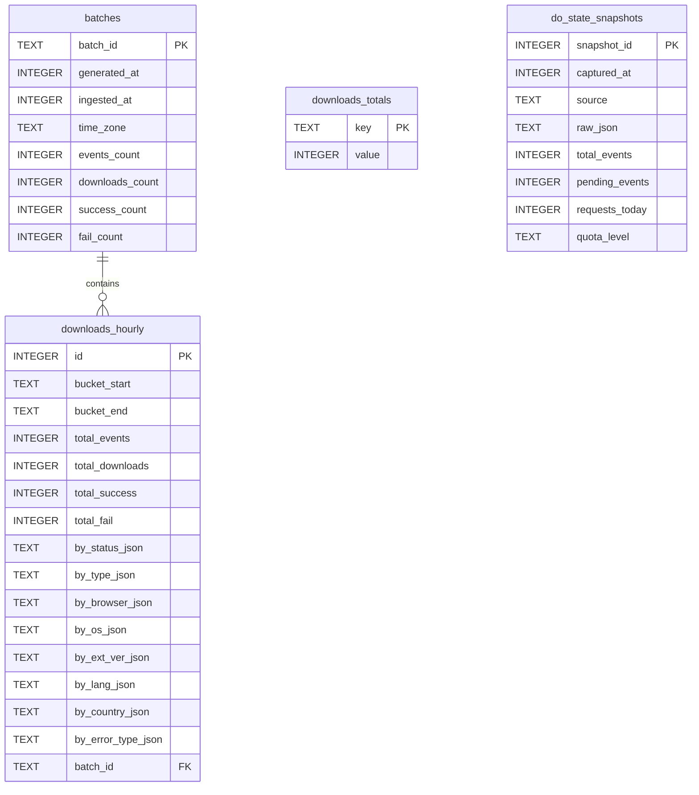
```mermaid
erDiagram
    batches ||--o{ downloads_hourly : "contains"
    batches {
        TEXT batch_id PK
        INTEGER generated_at
        INTEGER ingested_at
        TEXT time_zone
        INTEGER events_count
        INTEGER downloads_count
        INTEGER success_count
        INTEGER fail_count
    }

    downloads_hourly {
        INTEGER id PK
        TEXT bucket_start
        TEXT bucket_end
        INTEGER total_events
        INTEGER total_downloads
        INTEGER total_success
        INTEGER total_fail
        TEXT by_status_json
        TEXT by_type_json
        TEXT by_browser_json
        TEXT by_os_json
        TEXT by_ext_ver_json
        TEXT by_lang_json
        TEXT by_country_json
        TEXT by_error_type_json
        TEXT batch_id FK
    }

    downloads_totals {
        TEXT key PK
        INTEGER value
    }

    do_state_snapshots {
        INTEGER snapshot_id PK
        INTEGER captured_at
        TEXT source
        TEXT raw_json
        INTEGER total_events
        INTEGER pending_events
        INTEGER requests_today
        TEXT quota_level
    }
```

---

### 6. Physical Deployment Model

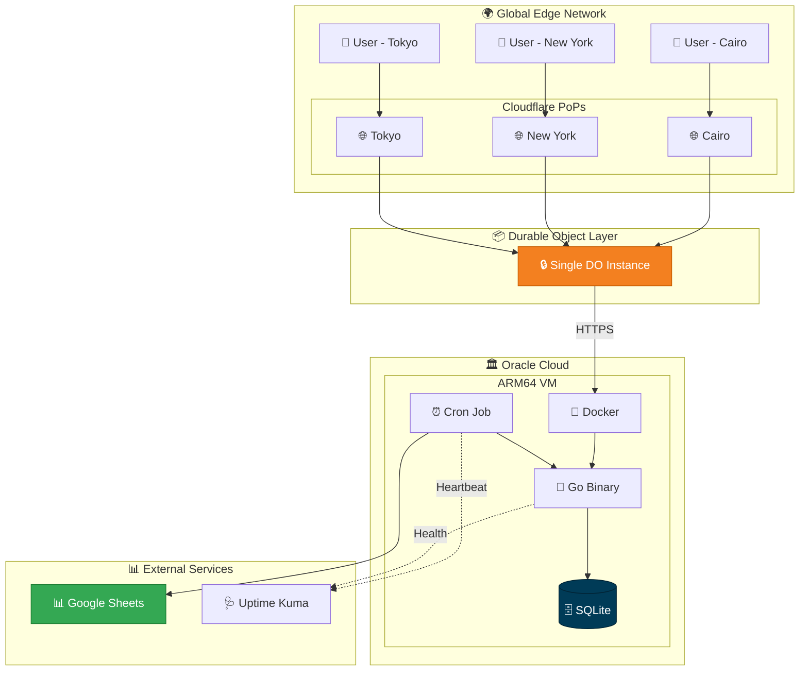
```mermaid
graph TB
    subgraph EdgeNetwork["🌍 Global Edge Network"]
        direction TB
        USER1["👤 User - Cairo"]
        USER2["👤 User - New York"]
        USER3["👤 User - Tokyo"]

        subgraph PoPs["Cloudflare PoPs"]
            POP1["🌐 Cairo"]
            POP2["🌐 New York"]
            POP3["🌐 Tokyo"]
        end

        USER1 --> POP1
        USER2 --> POP2
        USER3 --> POP3
    end

    subgraph DOLayer["📦 Durable Object Layer"]
        DO["🔒 Single DO Instance"]
    end

    subgraph OracleCloud["🏛️ Oracle Cloud"]
        subgraph VM["ARM64 VM"]
            DOCKER["🐳 Docker"]
            GO["🚀 Go Binary"]
            SQLITE[("🗄️ SQLite")]
            ARCHIVER["⏰ Cron Job"]
        end
    end

    subgraph External["📊 External Services"]
        SHEETS["📊 Google Sheets"]
        KUMA["🩺 Uptime Kuma"]
    end

    POP1 --> DO
    POP2 --> DO
    POP3 --> DO
    DO -->|HTTPS| DOCKER
    DOCKER --> GO
    GO --> SQLITE
    ARCHIVER --> GO
    ARCHIVER --> SHEETS
    ARCHIVER -.->|Heartbeat| KUMA
    GO -.->|Health| KUMA

    style DO fill:#F38020,stroke:#C65D00,color:#fff
    style SQLITE fill:#003B57,stroke:#002233,color:#fff
    style SHEETS fill:#34A853,stroke:#1E7E34,color:#fff
```

---

## 🌊 Data Flow Architecture

### Event Transformation Pipeline

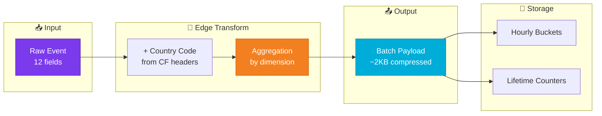
```mermaid
flowchart LR
    subgraph "📥 Input"
        RAW[Raw Event<br/>12 fields]
    end

    subgraph "🔄 Edge Transform"
        GEO[+ Country Code<br/>from CF headers]
        AGG[Aggregation<br/>by dimension]
    end

    subgraph "📤 Output"
        BATCH[Batch Payload<br/>~2KB compressed]
    end

    subgraph "💾 Storage"
        HOURLY[Hourly Buckets]
        TOTALS[Lifetime Counters]
    end

    RAW --> GEO
    GEO --> AGG
    AGG --> BATCH
    BATCH --> HOURLY
    BATCH --> TOTALS

    style RAW fill:#7C3AED,stroke:#5B21B6,color:#fff
    style AGG fill:#F38020,stroke:#C65D00,color:#fff
    style BATCH fill:#00ADD8,stroke:#0088A8,color:#fff
```

---

### Buffering Strategy — Time vs. Size

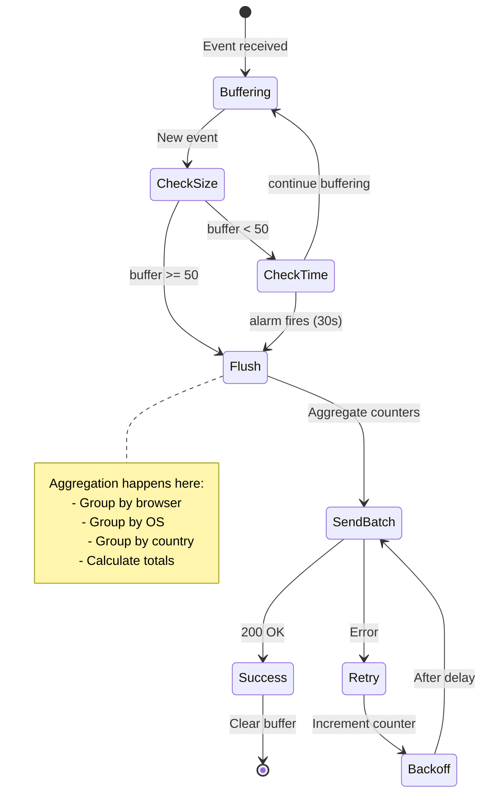
```mermaid
stateDiagram-v2
    [*] --> Buffering: Event received
  
    Buffering --> CheckSize: New event
    CheckSize --> Flush: buffer >= 50
    CheckSize --> CheckTime: buffer < 50
    CheckTime --> Flush: alarm fires (30s)
    CheckTime --> Buffering: continue buffering
  
    Flush --> SendBatch: Aggregate counters
    SendBatch --> Success: 200 OK
    SendBatch --> Retry: Error
  
    Success --> [*]: Clear buffer
    Retry --> Backoff: Increment counter
    Backoff --> SendBatch: After delay
  
    note right of Flush
        Aggregation happens here:
        - Group by browser
        - Group by OS  
        - Group by country
        - Calculate totals
    end note
```

---

### Backoff & Retry Logic


```mermaid
gantt
    title Exponential Backoff Schedule
    dateFormat X
    axisFormat %s

    section Retry Attempts
    Attempt 1 (1m)    :a1, 0, 60
    Attempt 2 (5m)    :a2, 60, 360
    Attempt 3 (15m)   :a3, 360, 1260
    Attempt 4 (30m)   :a4, 1260, 3060
    Attempt 5 (1h)    :a5, 3060, 6660
    Attempt 6 (3h)    :a6, 6660, 17460
    Max (24h)         :a7, 17460, 103860
```

---

### Component Diagram — Interface Contracts

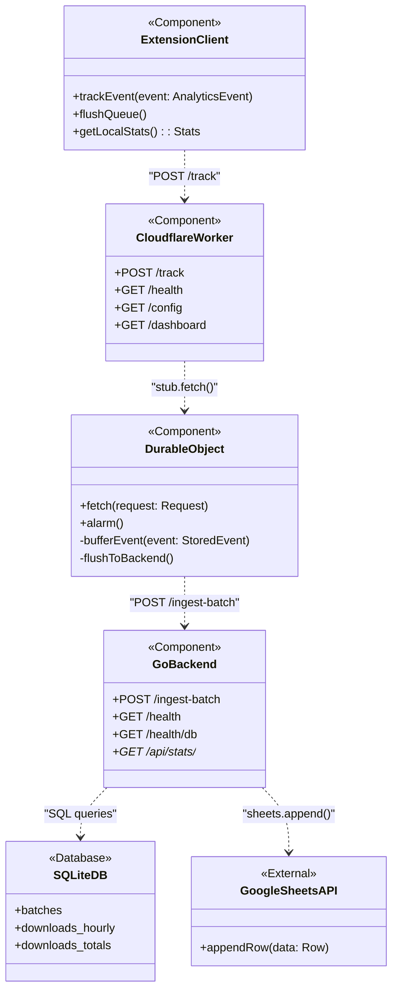
```mermaid
classDiagram
    direction TB

    class ExtensionClient {
        <<Component>>
        +trackEvent(event: AnalyticsEvent)
        +flushQueue()
        +getLocalStats(): Stats
    }

    class CloudflareWorker {
        <<Component>>
        +POST /track
        +GET /health
        +GET /config
        +GET /dashboard
    }

    class DurableObject {
        <<Component>>
        +fetch(request: Request)
        +alarm()
        -bufferEvent(event: StoredEvent)
        -flushToBackend()
    }

    class GoBackend {
        <<Component>>
        +POST /ingest-batch
        +GET /health
        +GET /health/db
        +GET /api/stats/*
    }

    class SQLiteDB {
        <<Database>>
        +batches
        +downloads_hourly
        +downloads_totals
    }

    class GoogleSheetsAPI {
        <<External>>
        +appendRow(data: Row)
    }

    ExtensionClient ..> CloudflareWorker : "POST /track"
    CloudflareWorker ..> DurableObject : "stub.fetch()"
    DurableObject ..> GoBackend : "POST /ingest-batch"
    GoBackend ..> SQLiteDB : "SQL queries"
    GoBackend ..> GoogleSheetsAPI : "sheets.append()"
```

---

### User Journey — Student Download Experience

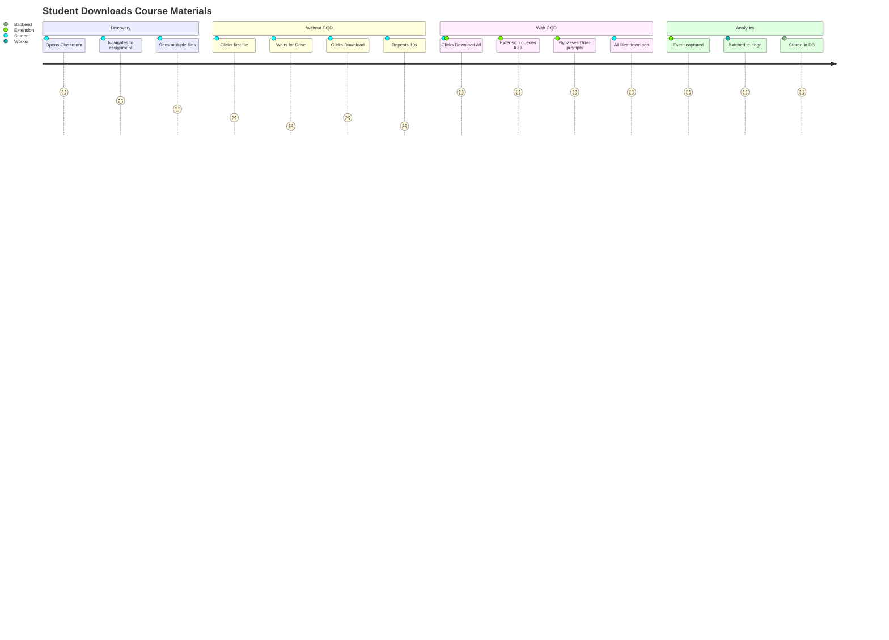
```mermaid
journey
    title Student Downloads Course Materials
    section Discovery
        Opens Classroom: 5: Student
        Navigates to assignment: 4: Student
        Sees multiple files: 3: Student
    section Without CQD
        Clicks first file: 2: Student
        Waits for Drive: 1: Student
        Clicks Download: 2: Student
        Repeats 10x: 1: Student
    section With CQD
        Clicks Download All: 5: Student, Extension
        Extension queues files: 5: Extension
        Bypasses Drive prompts: 5: Extension
        All files download: 5: Student
    section Analytics
        Event captured: 5: Extension
        Batched to edge: 5: Worker
        Stored in DB: 5: Backend
```

---

### C4 Container Diagram

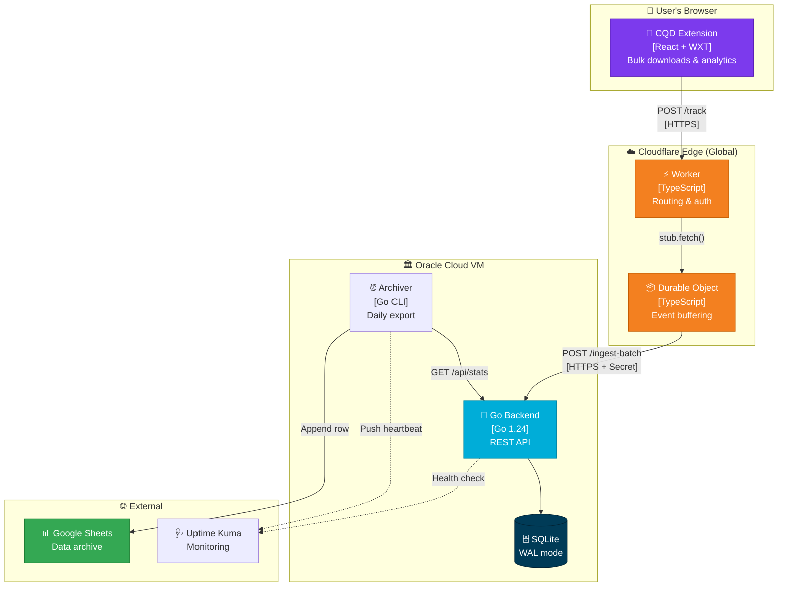
```mermaid
graph TB
    subgraph UserBrowser["👤 User's Browser"]
        EXT["🧩 CQD Extension\n[React + WXT]\nBulk downloads & analytics"]
    end

    subgraph CloudflareEdge["☁️ Cloudflare Edge (Global)"]
        WORKER["⚡ Worker\n[TypeScript]\nRouting & auth"]
        DO["📦 Durable Object\n[TypeScript]\nEvent buffering"]
    end

    subgraph OracleVM["🏛️ Oracle Cloud VM"]
        API["🚀 Go Backend\n[Go 1.24]\nREST API"]
        DB[("🗄️ SQLite\nWAL mode")]
        CRON["⏰ Archiver\n[Go CLI]\nDaily export"]
    end

    subgraph ExternalServices["🌐 External"]
        SHEETS["📊 Google Sheets\nData archive"]
        KUMA["🩺 Uptime Kuma\nMonitoring"]
    end

    EXT -->|"POST /track\n[HTTPS]"| WORKER
    WORKER -->|"stub.fetch()"| DO
    DO -->|"POST /ingest-batch\n[HTTPS + Secret]"| API
    API --> DB
    CRON -->|"GET /api/stats"| API
    CRON -->|"Append row"| SHEETS
    API -.->|"Health check"| KUMA
    CRON -.->|"Push heartbeat"| KUMA

    style EXT fill:#7C3AED,stroke:#5B21B6,color:#fff
    style WORKER fill:#F38020,stroke:#C65D00,color:#fff
    style DO fill:#F38020,stroke:#C65D00,color:#fff
    style API fill:#00ADD8,stroke:#0088A8,color:#fff
    style DB fill:#003B57,stroke:#002233,color:#fff
    style SHEETS fill:#34A853,stroke:#1E7E34,color:#fff
```

---

### Technology Mindmap

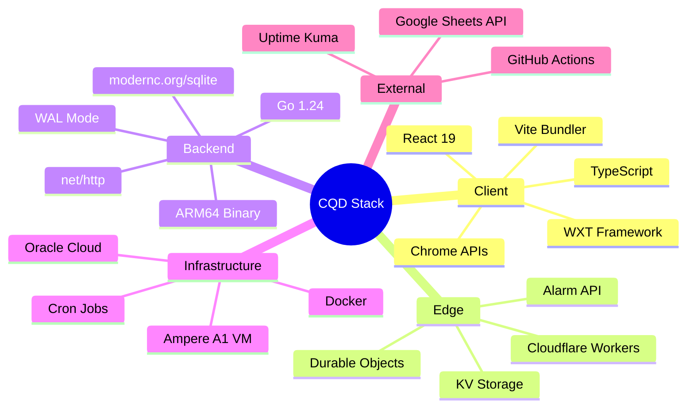
```mermaid
mindmap
    root((CQD Stack))
        Client
            React 19
            TypeScript
            WXT Framework
            Vite Bundler
            Chrome APIs
        Edge
            Cloudflare Workers
            Durable Objects
            Alarm API
            KV Storage
        Backend
            Go 1.24
            net/http
            modernc.org/sqlite
            WAL Mode
            ARM64 Binary
        Infrastructure
            Oracle Cloud
            Ampere A1 VM
            Docker
            Cron Jobs
        External
            Google Sheets API
            Uptime Kuma
            GitHub Actions
```

---

### Technology Trade-offs Quadrant

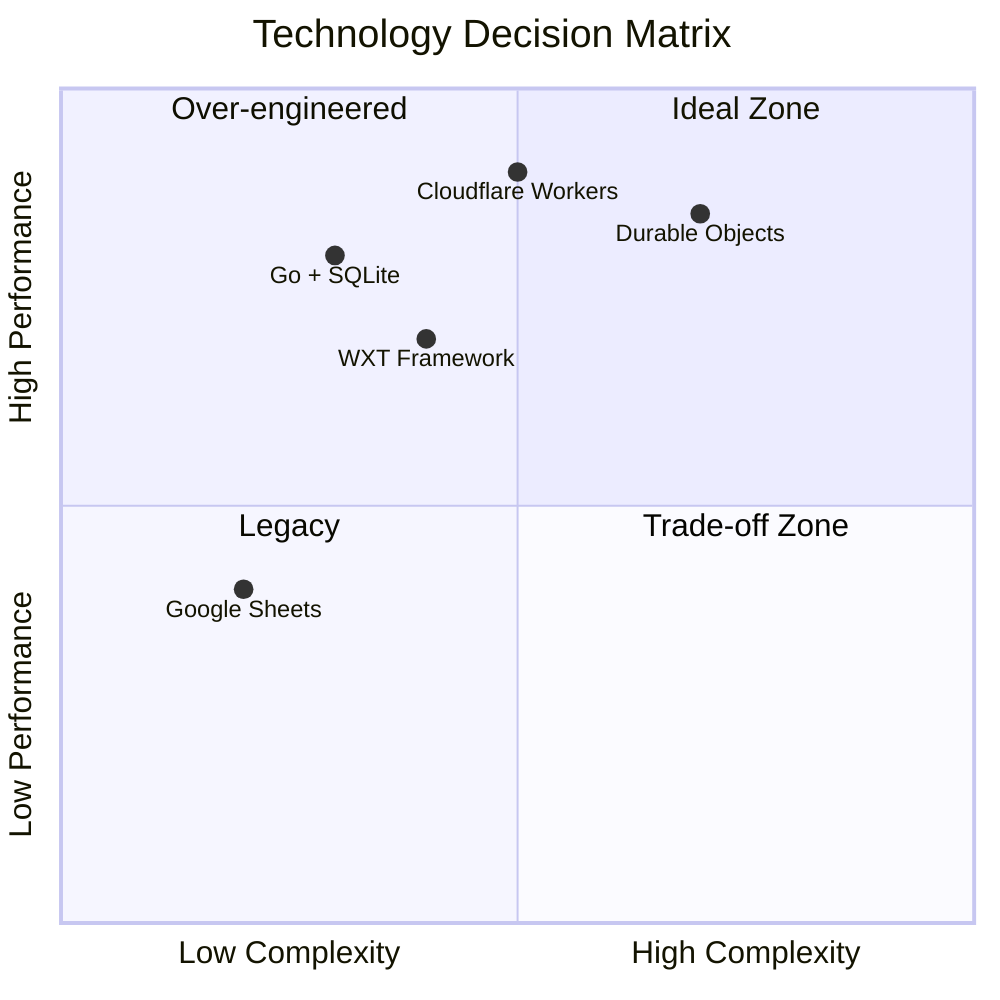
```mermaid
quadrantChart
    title Technology Decision Matrix
    x-axis Low Complexity --> High Complexity
    y-axis Low Performance --> High Performance
    quadrant-1 Ideal Zone
    quadrant-2 Over-engineered
    quadrant-3 Legacy
    quadrant-4 Trade-off Zone
    
    Durable Objects: [0.7, 0.85]
    Go + SQLite: [0.3, 0.8]
    WXT Framework: [0.4, 0.7]
    Cloudflare Workers: [0.5, 0.9]
    Google Sheets: [0.2, 0.4]
```

---

## 🧠 Technical Rationale

### Why Durable Objects?

> **The Split-Brain Problem:**
> Without strong consistency, two edge nodes could simultaneously flush overlapping events, causing duplicate counts or lost data.

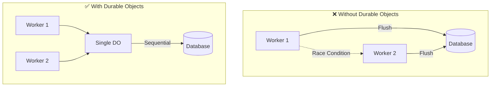
```mermaid
graph TD
    subgraph "❌ Without Durable Objects"
        W1[Worker 1] -->|Flush| DB1[(Database)]
        W2[Worker 2] -->|Flush| DB1
        W1 -.->|Race Condition| W2
    end

    subgraph "✅ With Durable Objects"
        W3[Worker 1] --> DO2[Single DO]
        W4[Worker 2] --> DO2
        DO2 -->|Sequential| DB2[(Database)]
    end
```

**Key Benefits:**


| Feature                       | Benefit                                              |
| ----------------------------- | ---------------------------------------------------- |
| **Single-threaded execution** | No race conditions, no locks                         |
| **Persistent state**          | Survives Worker restarts                             |
| **Global routing**            | All requests for "downloads" go to the same instance |
| **Alarm API**                 | Reliable scheduled flushes without cron              |

---

### Why Go + SQLite?

> **The Constraint:** Oracle Cloud Free Tier = 4 ARM cores, 24GB RAM, **zero budget for managed databases**.

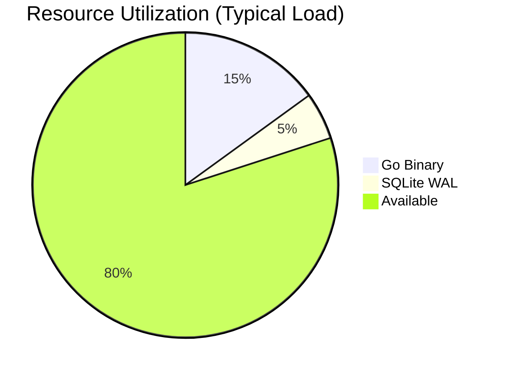
```mermaid
pie title Resource Utilization (Typical Load)
    "Go Binary" : 15
    "SQLite WAL" : 5
    "Available" : 80
```

**Technical Choices:**


| Choice                   | Rationale                                                 |
| ------------------------ | --------------------------------------------------------- |
| **`modernc.org/sqlite`** | Pure Go SQLite, no CGO. Single binary deployment.         |
| **WAL Mode**             | Concurrent reads during writes. No reader blocking.       |
| **`busy_timeout=5000`**  | Prevents "database is locked" under contention.           |
| **ARM64 Binary**         | Native compilation for Ampere A1 (no emulation overhead). |

---

### Batching Strategy — The Math

```
┌─────────────────────────────────────────────────────────────────────────────┐
│                           BATCHING THRESHOLD LOGIC                           │
├─────────────────────────────────────────────────────────────────────────────┤
│                                                                              │
│   IF (buffer.length >= 50)           → Flush immediately                     │
│   ELSE IF (queue < 15 && age > 2h)   → Flush (low activity user)            │
│   ELSE IF (queue < 35 && age > 1h)   → Flush (medium activity)              │
│   ELSE IF (queue < 50 && age > 30m)  → Flush (high activity)                │
│   ELSE                                → Continue buffering                   │
│                                                                              │
│   ═══════════════════════════════════════════════════════════════════════   │
│                                                                              │
│   NETWORK SAVINGS:                                                           │
│   ─────────────────                                                          │
│   Without batching: 10,000 requests × 1KB = 10MB/hour                       │
│   With batching:    200 requests × 2KB = 400KB/hour                         │
│   Reduction:        96% ↓                                                   │
│                                                                              │
└─────────────────────────────────────────────────────────────────────────────┘
```

---

## 🔒 Reliability & Security

### The Dead Man's Switch — Cron Monitoring

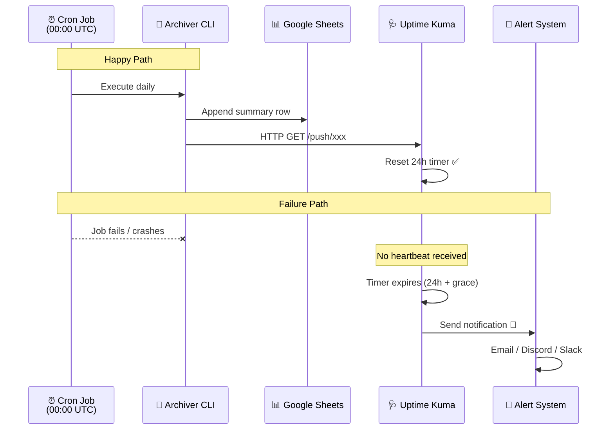
```mermaid
sequenceDiagram
    participant Cron as ⏰ Cron Job<br/>(00:00 UTC)
    participant Archiver as 📜 Archiver CLI
    participant Sheets as 📊 Google Sheets
    participant Kuma as 🩺 Uptime Kuma
    participant Alert as 🚨 Alert System

    Note over Cron,Archiver: Happy Path
    Cron->>Archiver: Execute daily
    Archiver->>Sheets: Append summary row
    Archiver->>Kuma: HTTP GET /push/xxx
    Kuma->>Kuma: Reset 24h timer ✅

    Note over Cron,Alert: Failure Path
    Cron--xArchiver: Job fails / crashes
    Note over Kuma: No heartbeat received
    Kuma->>Kuma: Timer expires (24h + grace)
    Kuma->>Alert: Send notification 🔴
    Alert->>Alert: Email / Discord / Slack
```

---

### Authentication Flow — DO_SHARED_SECRET

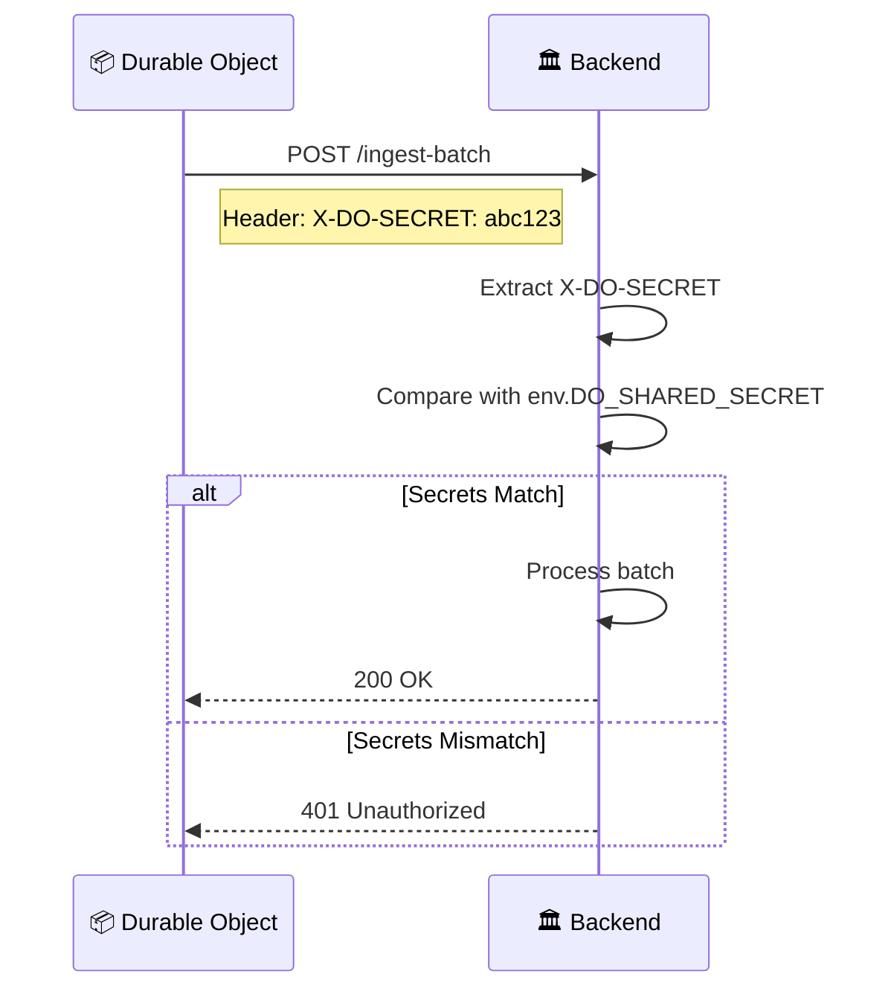
```mermaid
sequenceDiagram
    participant DO as 📦 Durable Object
    participant Backend as 🏛️ Backend

    DO->>Backend: POST /ingest-batch
    Note right of DO: Header: X-DO-SECRET: abc123
  
    Backend->>Backend: Extract X-DO-SECRET
    Backend->>Backend: Compare with env.DO_SHARED_SECRET
  
    alt Secrets Match
        Backend->>Backend: Process batch
        Backend-->>DO: 200 OK
    else Secrets Mismatch
        Backend-->>DO: 401 Unauthorized
    end
```

**Security Properties:**


| Property                     | Implementation                                   |
| ---------------------------- | ------------------------------------------------ |
| **Constant-time comparison** | Prevents timing attacks                          |
| **Secret rotation**          | Change in Cloudflare + Docker with zero downtime |
| **No secret in logs**        | Never logged or included in error messages       |
| **HTTPS only**               | All traffic encrypted in transit                 |

---

### Multi-Layer Health Monitoring

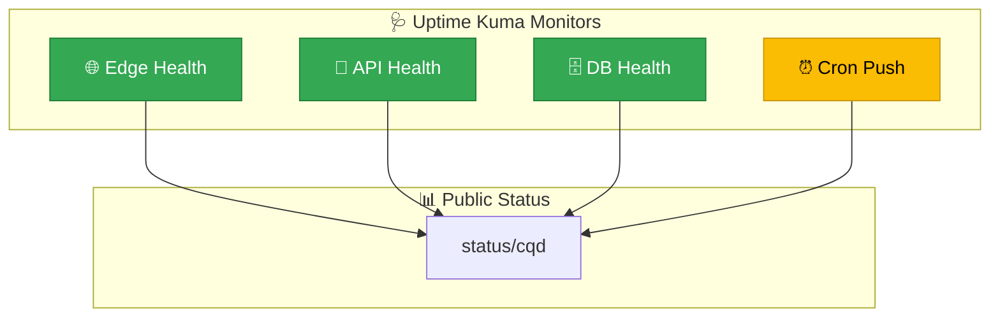
```mermaid
graph TD
    subgraph Monitors["🩺 Uptime Kuma Monitors"]
        M1["🌐 Edge Health"]
        M2["🚀 API Health"]
        M3["🗄️ DB Health"]
        M4["⏰ Cron Push"]
    end

    subgraph Public["📊 Public Status"]
        STATUS["status/cqd"]
    end

    M1 --> STATUS
    M2 --> STATUS
    M3 --> STATUS
    M4 --> STATUS

    style M1 fill:#34A853,stroke:#1E7E34,color:#fff
    style M2 fill:#34A853,stroke:#1E7E34,color:#fff
    style M3 fill:#34A853,stroke:#1E7E34,color:#fff
    style M4 fill:#FBBC04,stroke:#C99400,color:#000
```

---

## ⚡ Performance Characteristics

### Latency Profile

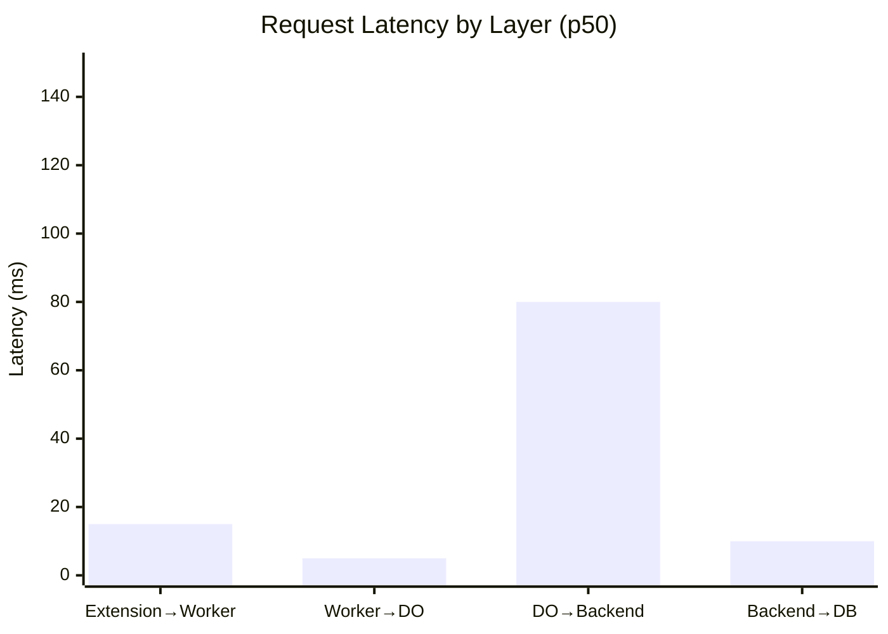
```mermaid
xychart-beta
    title "Request Latency by Layer (p50)"
    x-axis ["Extension→Worker", "Worker→DO", "DO→Backend", "Backend→DB"]
    y-axis "Latency (ms)" 0 --> 150
    bar [15, 5, 80, 10]
```

---

### Throughput Capacity


| Component             | Capacity      | Bottleneck             |
| --------------------- | ------------- | ---------------------- |
| **Cloudflare Worker** | 100,000 req/s | No practical limit     |
| **Durable Object**    | ~1,000 req/s  | Single-threaded JS     |
| **Go Backend**        | ~5,000 req/s  | CPU-bound JSON parsing |
| **SQLite (WAL)**      | ~500 writes/s | Disk I/O               |

---

### Cost Analysis — Free Tier Sustainability

```
┌─────────────────────────────────────────────────────────────────────────────┐
│                           MONTHLY COST BREAKDOWN                             │
├─────────────────────────────────────────────────────────────────────────────┤
│                                                                              │
│   CLOUDFLARE WORKERS                                                         │
│   ───────────────────                                                        │
│   Free tier: 100,000 requests/day                                           │
│   CQD usage: ~5,000 requests/day                                            │
│   Cost: $0.00                                                               │
│                                                                              │
│   CLOUDFLARE DURABLE OBJECTS                                                │
│   ─────────────────────────                                                 │
│   Free tier: 1M requests + 1GB storage                                      │
│   CQD usage: ~150K requests + 10KB                                          │
│   Cost: $0.00                                                               │
│                                                                              │
│   ORACLE CLOUD (AMPERE A1)                                                  │
│   ──────────────────────                                                    │
│   Free tier: 4 OCPUs + 24GB RAM (Always Free)                               │
│   CQD usage: 1 OCPU + 1GB RAM                                               │
│   Cost: $0.00                                                               │
│                                                                              │
│   GOOGLE SHEETS API                                                          │
│   ─────────────────                                                         │
│   Free tier: Unlimited (with service account)                               │
│   CQD usage: 1 request/day                                                  │
│   Cost: $0.00                                                               │
│                                                                              │
│   ═══════════════════════════════════════════════════════════════════════   │
│   TOTAL MONTHLY COST: $0.00                                                 │
│   ═══════════════════════════════════════════════════════════════════════   │
│                                                                              │
└─────────────────────────────────────────────────────────────────────────────┘
```

---

<div align="center">

## 🏁 Summary

**CQD demonstrates that production-grade distributed systems can be built on a student budget.**

The architecture prioritizes:

- **Edge-first ingestion** for global low-latency
- **Strong consistency** via Durable Objects
- **Cost efficiency** through aggressive batching
- **Operational simplicity** with single-binary deployments

---

*Built with ☕️ by [Adham Haitham](https://github.com/adhamhaithameid)*

</div>
