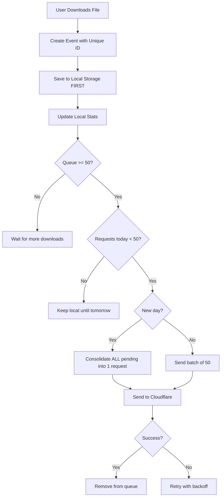

# Fail-Safe Analytics System

This document explains the analytics system's design for **zero data loss** while **protecting the free Cloudflare plan**.

## Core Strategy

```
Downloads → Local Queue → Batch (50) → Single Request → Cloudflare
```

**Key Principle:** Users can download unlimited files. Rate limiting only affects *requests to Cloudflare*, never the user's download experience.

---

## How Batching Works

| Downloads | Requests to Cloudflare |
|-----------|------------------------|
| 1-50 | 0 (saved locally, waiting) |
| 50 | 1 (batch sent) |
| 100 | 2 |
| 2500 | 50 (daily limit reached) |
| 2500+ | 50 (rest saved for tomorrow) |

**Max daily Cloudflare usage per user:** 50 requests × 50 events = 2,500 download events tracked.

---

## Blackout Window (12:00 AM - 1:00 AM Local Time)

To ensure system stability during the critical midnight flush from Worker to Oracle:

1. **Extension enters Blackout Mode:** No requests are sent to Cloudflare between 12:00 AM and 1:00 AM local time.
2. **Local Queueing:** All events generated during this hour are saved to local storage.
3. **1:00 AM Flush:** At 1:00 AM, the extension wakes up and consolidates ALL pending events (including those from the blackout) into as few requests as possible.

This prevents race conditions and ensures the Worker has a quiet period to flush its buffer to the Oracle backend (which happens at 00:00 UTC).

---

## Scenarios

### Scenario 1: Normal Usage (100 downloads)
1. User downloads 100 files throughout the day
2. After download 50 → Extension sends **1 request** to Cloudflare
3. After download 100 → Extension sends **1 more request**
4. **Total Cloudflare requests: 2**

### Scenario 2: Heavy Usage (3000 downloads)
1. User downloads 3000 files in one day
2. Downloads 1-50 → Request 1
3. Downloads 51-100 → Request 2
4. ... continues ...
5. Downloads 2451-2500 → Request 50 (daily limit)
6. Downloads 2501-3000 → **Saved locally, no request**
7. **Next day:** Extension detects new day, sends ALL 500 pending events in **ONE request**
8. **Total: 50 requests today + 1 request tomorrow = 51 total**

### Scenario 3: Offline/Network Error
1. User downloads 50 files offline
2. Extension tries to send → Network error
3. Events stay in local queue
4. Extension retries with backoff: 1min → 5min → 15min → 30min → 1h...
5. Connection restored → Successful send
6. **Zero data lost**

### Scenario 4: Browser Crash
1. User downloads file, closes browser immediately
2. Event saved to disk **BEFORE** network request
3. Next browser session: Event found in queue, sent automatically
4. **Zero data lost**

### Scenario 5: Emergency (Cloudflare overload)
1. You notice Cloudflare usage spiking
2. From Cloudflare dashboard: Set `hardRemoteOff: true`
3. All extensions worldwide immediately switch to local-only mode
4. Events accumulate locally
5. When crisis passes: Set `hardRemoteOff: false`
6. Extensions resume sending with next-day consolidation
7. **Zero data lost, zero cost during crisis**

---

## Remote Control (via Worker /config)

The worker's `/config` endpoint returns settings that control extension behavior:

```json
{
  "remoteEnabled": true,    // false = all extensions go local-only
  "batchSize": 50,          // events per request
  "timeFlushMinutes": {
    "low": 120,   // flush every 2h if <15 events
    "mid": 60,    // flush every 1h if 15-35 events
    "high": 30    // flush every 30min if 35+ events
  }
}
```

**To disable ALL extensions remotely:** Set `hardRemoteOff: true` in worker state. This propagates to all extensions within their next config refresh (every few hours).

---

## Data Flow Summary



---

## Constants

| Location | Constant | Value | Purpose |
|----------|----------|-------|---------|
| Extension | `BATCH_SIZE` | 50 | Downloads per request |
| Extension | `MAX_DAILY_REQUESTS` | 50 | Requests per day per extension |
| Extension | `MAX_RETRY` | 5 | Max retries before dropping "poison" event |
| Worker | `MAX_EVENTS_PER_REQUEST` | 5000 | Allows next-day consolidation |
| Worker | `MAX_BUFFER_SIZE` | 50,000 | Global buffer limit |
