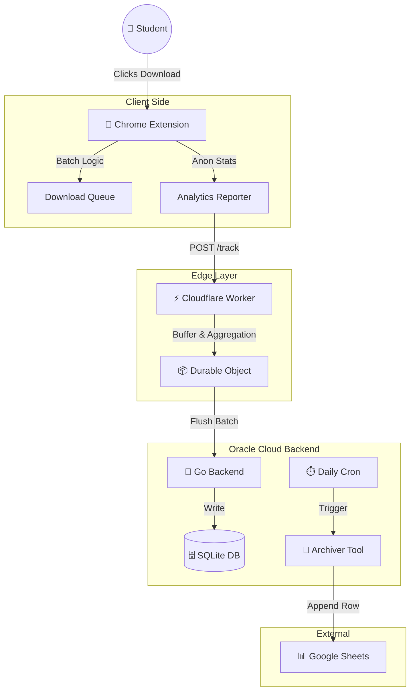
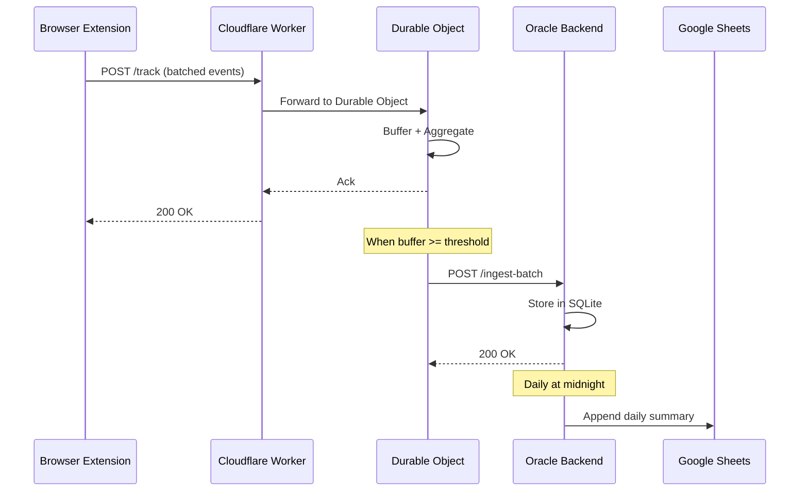

<div align="center">

# 🎓 Classroom Quick Downloader

<!-- Client Stack -->


<!-- Browsers Versions -->


<!-- Edge Stack -->


<!-- Backend Stack -->


<!-- Status -->


<!-- Uptime Kuma Live Status -->

[](http://129.151.233.229:3001/status/cqd)
[](http://129.151.233.229:3001/status/cqd)
[](http://129.151.233.229:3001/status/cqd)
[](http://129.151.233.229:3001/status/cqd)

---

**Downloading files from Google Classroom shouldn't feel like a chore.** CQD transforms bulk file downloads into a single click while powering an enterprise-grade analytics pipeline that tracks millions of download events at the edge.

[📦 Extension](#-the-extension-client) · [⚡ Worker](#-the-worker-edge) · [🏛️ Backend](#-the-backend-sink) · [🚀 Getting Started](#-getting-started) · [📘 Deployment](DEPLOYMENT.md)

</div>

---

## 📖 The Backstory: From a Bored Student to a Distributed System

As a software engineer, I found myself trapped in a loop of repetitive, manual labor every time I needed course materials. Downloading files one-by-one wasn't just slow—it felt like a technical debt I was paying every day. Eventually, the "misery" of clicking through dozens of links became too much to ignore.

### The Paper Manifesto

The plan for CQD didn't start in an IDE; it started on a piece of paper during a particularly boring university lecture. Out of pure frustration, I began sketching a solution. What started as a student’s bored scribbles quickly evolved into a rigorous system architecture, complete with data flow diagrams and a security-first mindset.

### The Evolution

I moved the plan from paper to Notion, created this repository, and began tracking the technical journey through GitHub issues.

* **V1:** A raw prototype built with native JavaScript.
* **Modern Stack:** After several iterations, I migrated to the **WXT** framework to build a robust, production-grade extension.

### Validating the Pain

To ensure I wasn't alone in this frustration, I conducted a local survey among my colleagues. The results were unanimous: everyone was struggling. This "misery" reaches its peak during final exams, when we all rush to download massive amounts of study material, and every second wasted on manual clicks counts.

### 🛡️ The Misery Cure (Mostly Universal)
I've spent countless hours testing this extension across multiple browsers and operating systems to ensure every student has access to the "cure." Whether you are on Windows, Mac, or Linux, or using Chrome, Edge, or Firefox—I've got you covered. 

*(Wait, What about Safari? We don't talk about Safari. You're on your own there, buddy.)*

**CQD is built by a student, for students.** It’s a tool rooted in human connection and shared academic trauma, designed to make your student life just a little bit more bearable.

---

## 📂 Project Modules & Documentation

> **This is a complex distributed system.** Each module has its own comprehensive README with implementation details, API references, and configuration guides. Start here for the big picture, then dive into the module you're working on.


| Module           | Description                                                                                    | Documentation                                        |
| ---------------- | ---------------------------------------------------------------------------------------------- | ---------------------------------------------------- |
| **🧩 Extension** | Browser extension for bulk downloading from Google Classroom. Built with WXT + React.          | [Read Extension Docs →](./extension/README.md)      |
| **⚡ Worker**    | Edge ingestion layer on Cloudflare. Buffers events in Durable Objects and pre-aggregates data. | [Read Worker Docs →](./cloudflare-worker/README.md) |
| **🏛️ Backend** | Go server with SQLite storage, analytics API, and Google Sheets archiver.                      | [Read Backend Docs →](./oracle-backend/README.md)   |
| **🛠️ Tools**   | DevOps scripts for validation, pipeline testing, and deployment automation.                    | [View Scripts →](./tools/)                          |

---

## 🌍 System Architecture

CQD is not just a browser extension—it's a **distributed analytics system** designed for scale, resilience, and cost-efficiency.



### Detailed Data Flow

```
┌─────────────────────────────────────────────────────────────────────────────────────────┐
│                                    USER'S BROWSER                                       │
│                                                                                         │
│   ┌─────────────────────────────────────────────────────────────────────────────────┐   │
│   │                     CQD Browser Extension (Client)                              │   │
│   │   • Bulk file downloads from Google Classroom                                   │   │
│   │   • Automatic Drive confirmation bypass                                         │   │
│   │   • Anonymous event tracking (file type, duration, success/fail)                │   │
│   └─────────────────────────────────────────────────────────────────────────────────┘   │
│                                          │                                              │
│                                          │  POST /track (batched events)                │
│                                          │                                              │
└──────────────────────────────────────────┼──────────────────────────────────────────────┘
                                           │
                                           ▼
┌──────────────────────────────────────────────────────────────────────────────────────────┐
│                              CLOUDFLARE EDGE (Global)                                    │
│                                                                                          │
│   ┌────────────────────────────────────────────────────────────────────────────────────┐ │
│   │                           Worker + Durable Object                                  │ │
│   │   • Low-latency ingestion at 300+ edge locations                                   │ │
│   │   • Event buffering with Durable Object state persistence                          │ │
│   │   • Pre-aggregation: calculates Top Browser, Top Country, etc.                     │ │
│   │   • Smart batching with exponential backoff retry                                  │ │
│   └────────────────────────────────────────────────────────────────────────────────────┘ │
│                                          │                                               │
│                                          │  POST /ingest-batch (aggregated JSON)         │
│                                          │                                               │
└──────────────────────────────────────────┼───────────────────────────────────────────────┘
                                           │
                                           ▼
┌──────────────────────────────────────────────────────────────────────────────────────────┐
│                           ORACLE CLOUD (ARM64 Ampere)                                    │
│                                                                                          │
│   ┌────────────────────────────────────────────────────────────────────────────────────┐ │
│   │                       Go Backend + SQLite (WAL Mode)                               │ │
│   │   • Persistent storage with zero external dependencies                             │ │
│   │   • Real-time analytics dashboard                                                  │ │
│   │   • Time-series data with hourly/daily granularity                                 │ │
│   └────────────────────────────────────────────────────────────────────────────────────┘ │
│                                          │                                               │
│                                          │  Daily Cron Job                               │
│                                          ▼                                               │
│   ┌────────────────────────────────────────────────────────────────────────────────────┐ │
│   │                         Google Sheets (Archive)                                    │ │
│   │   • Long-term historical data                                                      │ │
│   │   • Easy sharing and reporting                                                     │ │
│   └────────────────────────────────────────────────────────────────────────────────────┘ │
└──────────────────────────────────────────────────────────────────────────────────────────┘
```

### 📍 The Journey of an Analytics Event

Every download attempt in the [Extension](./extension/) triggers an analytics event. Here's its complete journey through the system:

1. **📥 Capture (Client)** — The [Extension](./extension/) records: file type, browser, OS, duration, and success/fail status. Events are queued locally in `chrome.storage`.
2. **📤 Batch & Send (Client → Edge)** — When the queue reaches 50 events (or after a time threshold), the extension POSTs the batch to the [Cloudflare Worker](./cloudflare-worker/).
3. **🔄 Buffer & Aggregate (Edge)** — The [Worker](./cloudflare-worker/) forwards events to its [Durable Object](./cloudflare-worker/README.md#why-durable-objects), which:

* Persists events in memory (survives Worker restarts).
* Aggregates counters: by browser, by OS, by country, by file type.
* Calculates "Top" stats: most common browser, most active country, etc.

4. **🚀 Flush (Edge → Backend)** — When the buffer exceeds `MAX_BATCH_EVENTS` or an alarm fires, the DO sends a pre-aggregated JSON payload to the [Oracle Backend](./oracle-backend/).
5. **💾 Store (Backend)** — The [Backend](./oracle-backend/) receives the batch, deduplicates by `batchId`, and stores:

* Raw batch metadata in `batches` table.
* Hourly aggregates in `downloads_hourly` table.
* Lifetime totals in `downloads_totals` key-value table.

6. **📊 Archive (Backend → Sheets)** — At midnight UTC, a cron job runs the [Archiver](./oracle-backend/README.md%23-google-sheets-archiver), which:

* Fetches the current summary from the local API.
* Appends a row to Google Sheets with all dimension breakdowns.

---

## 🧠 Why This Stack?

### Why Durable Objects?

> **Problem:** If every extension sends events directly to our database, we'd have thousands of concurrent writes—overwhelming SQLite and spiking costs.

**Solution:** [Durable Objects](./cloudflare-worker/README.md) act as a **global buffer**. All events for a given namespace (e.g., "downloads") are routed to the *same* instance, regardless of which edge location receives the request. This provides:

* **Strong consistency** — No split-brain, no race conditions.
* **Persistence** — State survives Worker restarts.
* **Rate limiting** — We control how often we flush to the backend.
* **Pre-aggregation** — Compute "Top Browser" before sending, saving backend CPU.

### Why Go + SQLite?

> **Problem:** We need maximum performance on Oracle Cloud's Free Tier (4 ARM cores, 24GB RAM) without paying for managed databases.

**Solution:** [Go with pure-Go SQLite](./oracle-backend/README.md) (no CGO) gives us:

* **Single binary deployment** — No runtime dependencies.
* **Zero external services** — No Postgres, no Redis, no connection pooling.
* **WAL mode** — Concurrent reads while writing.
* **ARM64 optimized** — Native compilation for Ampere A1.

### Why WXT?

> **Problem:** Building Manifest v3 extensions with React is painful—bundling, HMR, multi-target builds.

**Solution:** [WXT](./extension/README.md) provides:

* **File-system routing** — `popup/index.html`, `background.ts`, `*.content.ts` just work.
* **Hot Module Replacement** — See changes instantly during development.
* **Cross-browser builds** — Chrome and Firefox from the same codebase.
* **TypeScript-first** — Auto-imports, type safety, and modern DX.

---

## 🛠️ Tech Stack Matrix


| Layer            | Language   | Key Technologies                                            | Data Flow                                            |
| ---------------- | ---------- | ----------------------------------------------------------- | ---------------------------------------------------- |
| **🧩 Client**    | TypeScript | [WXT](./extension/), React 19, Chrome APIs                  | Captures events → Queues locally → Batches to Edge |
| **⚡ Edge**      | TypeScript | [Cloudflare Workers](./cloudflare-worker/), Durable Objects | Buffers events → Aggregates → Flushes to Backend   |
| **🏛️ Backend** | Go         | [net/http](./oracle-backend/), SQLite (pure Go), Docker     | Stores batches → Serves API → Archives to Sheets   |

---

## ✨ Features

### For Users

* **📦 Bulk Downloads** — Download all files from a Classroom assignment with one click.
* **🔓 Drive Bypass** — Automatically handles Google Drive's "Download anyway" confirmation pages.
* **🔄 Multi-Account Support** — Cycles through your Google accounts to find the one with access.
* **📊 Local Stats** — See your download history right in the [Extension](./extension/) popup.

### For Developers

* **📈 Real-time Dashboard** — Monitor download events, success rates, and breakdowns by browser/OS/country.
* **⏱️ Time-Series Analytics** — Hourly and daily granularity for trend analysis.
* **📋 Google Sheets Archive** — Automated daily exports for long-term reporting.
* **🔒 Privacy-First** — No PII collected. Only file types, durations, and success/fail status.

---

## 🚀 Getting Started

### Prerequisites


| Tool                                                            | Version | Purpose                                                                  |
| --------------------------------------------------------------- | ------- | ------------------------------------------------------------------------ |
| [Node.js](https://nodejs.org/)                                  | 20+     | [Extension](./extension/) and [Worker](./cloudflare-worker/) development |
| [pnpm](https://pnpm.io/)                                        | 8+      | Monorepo package management                                              |
| [Go](https://go.dev/)                                           | 1.24+   | [Oracle Backend](./oracle-backend/)                                      |
| [Docker](https://docker.com/)                                   | 20+     | [Backend](./oracle-backend/) deployment                                  |
| [Wrangler](https://developers.cloudflare.com/workers/wrangler/) | Latest  | [Cloudflare Worker](./cloudflare-worker/) CLI                            |

### Quick Start

```bash
# Clone the repository
git clone https://github.com/adhamhaithameid/Classroom-Quick-Downloader.git
cd Classroom-Quick-Downloader

# Install all dependencies (monorepo)
pnpm install

# Run the extension in development mode
cd extension && pnpm dev
```

### Full Validation Suite

Run static analysis, type checking, and local health probes:

```bash
./tools/validate.sh
```

This script:

1. Lints the [Cloudflare Worker](./cloudflare-worker/) (`eslint`).
2. Type-checks the [Worker](./cloudflare-worker/) (`tsc --noEmit`).
3. Audits npm dependencies.
4. Runs a local Worker health check.

### Test the Analytics Pipeline

Simulate the full data flow from [Extension](./extension/) → [Worker](./cloudflare-worker/) → [Backend](./oracle-backend/):

```bash
./tools/test_pipeline.sh
```

This script:

1. Sends mock events to the [Worker](./cloudflare-worker/).
2. Triggers a force-flush.
3. Verifies data appears in the [Backend](./oracle-backend/).

---

## 🚢 Deployment

Deploying CQD involves three independent deployments:


| Component        | Platform              | Guide                                                                                                             |
| ---------------- | --------------------- | ----------------------------------------------------------------------------------------------------------------- |
| **🏛️ Backend** | Oracle Cloud (Docker) | [DEPLOYMENT.md § Backend](DEPLOYMENT.md%23part-1-oracle-backend-deployment)      |
| **⚡ Worker**    | Cloudflare            | [DEPLOYMENT.md § Worker](DEPLOYMENT.md%23part-2-cloudflare-worker-configuration) |
| **🧩 Extension** | Chrome Web Store      | [Extension README](./extension/README.md%23build-for-production)                  |

> **📘 See [DEPLOYMENT.md](DEPLOYMENT.md) for the complete step-by-step guide.**

### Quick Reference

```bash
# Deploy Oracle Backend
cd oracle-backend && ./deploy.sh

# Deploy Cloudflare Worker
cd cloudflare-worker
npx wrangler secret put DO_SHARED_SECRET
npm run deploy

# Build Extension for Web Store
cd extension && npm run zip
```

---

## 📊 Analytics Flow Summary



---

## 🔒 Security & Privacy


| Concern                | Implementation                                                                                                                                                              |
| ---------------------- | --------------------------------------------------------------------------------------------------------------------------------------------------------------------------- |
| **Authentication**     | Shared secret (`DO_SHARED_SECRET`) between [Worker](./cloudflare-worker/) and [Backend](./oracle-backend/). |
| **Data Privacy**       | No usernames, emails, or file names collected. Only: file type, browser, OS, country, duration.                                                                             |
| **Transport**          | All external communication over HTTPS.                                                                                                                                      |
| **Secrets Management** | Cloudflare Secrets API + Docker environment variables. Never committed to git.                                                                                              |

---

## 🩺 System Health & Monitoring

Production systems require production-grade monitoring. CQD uses a self-hosted **Uptime Kuma** instance running on the Oracle Cloud VM to monitor every layer of the analytics stack.

### Active Monitors


| Monitor                        | Type                     | Target                                                                        | What It Checks                                                            |
| ------------------------------ | ------------------------ | ----------------------------------------------------------------------------- | ------------------------------------------------------------------------- |
| **🌐 Edge Availability**       | HTTP(S)                  | [Worker](./cloudflare-worker/) `/health`      | Cloudflare Worker is globally reachable and routing to the Durable Object |
| **🚀 API Health**              | HTTP                     | [Backend](./oracle-backend/) `GET /health`    | Go server is running and accepting connections                            |
| **🗄️ Database Integrity**    | HTTP                     | [Backend](./oracle-backend/) `GET /health/db` | SQLite is writable and not locked (WAL mode healthy)                      |
| **⏱️ Cron Job Verification** | Push (Dead Man's Switch) | Archiver cron                                                                 | Daily`archive-stats` job completed successfully                           |

### How Cron Monitoring Works

The archiver uses a **Push Monitor** (Dead Man's Switch pattern):

```
┌─────────────────────────────────────────────────────────────┐
│   CRON: 0 0 * * * /app/archiver && curl <push-url>         │
└──────────────────────────────┬──────────────────────────────┘
                               │ (on success)
                               ▼
┌─────────────────────────────────────────────────────────────┐
│   UPTIME KUMA: Expects heartbeat within 24h + grace        │
│   No heartbeat? → Email/Discord/Slack alert triggered      │
└─────────────────────────────────────────────────────────────┘
```

If the cron job fails to run, the archiver crashes, or the Google Sheets upload fails—we get alerted automatically.

### Deployment

Start the monitoring stack with a single Docker command:

```bash
docker run -d \
  --restart=always \
  -p 3001:3001 \
  -v uptime-kuma:/app/data \
  --name uptime-kuma \
  louislam/uptime-kuma:latest
```

### Public Status Page

Users can check system health at any time:

```
http://<your-vm-ip>:3001/status/cqd
```

This page shows real-time status, uptime percentages, and incident history—useful for self-diagnosing issues before opening a support request.

---

## 🤝 Feedback & Issues

This project is **Source Available**. You are welcome to review the code and share it, but modification and derivative works are not permitted without permission.

### Found a bug or have a suggestion?

We strictly do **not** accept Pull Requests or Code Modifications from the public. However, we value your feedback!

Please report issues or suggestions via:

1. **GitHub Issues:** [Open an Issue here](../../issues)
2. **Feedback Form:** [Submit via Google Forms](https://docs.google.com/forms/d/1nB95r35O_h98odg8Y6_OrfYdjKGBqhrUCb_wFHA-RA8/edit)

### ⚠️ Licensing & Usage

This software is **Proprietary & Source Available**. Copyright © 2025 Adham Haitham. All Rights Reserved.

* ✅ **You can:** View, read, and use the extension for personal, non-commercial purposes.
* ❌ **You cannot:** Modify, edit, or build upon the source code.
* ❌ **You cannot:** Distribute modified versions or forks.
* ❌ **You cannot:** Use this code for commercial purposes.

For commercial inquiries or modification requests, please contact me directly.

---

<div align="center">

**Built with ☕ by [Adham Haitham](https://github.com/adhamhaithameid)**
*A sophisticated analytics pipeline masquerading as a simple productivity tool.*

</div>
