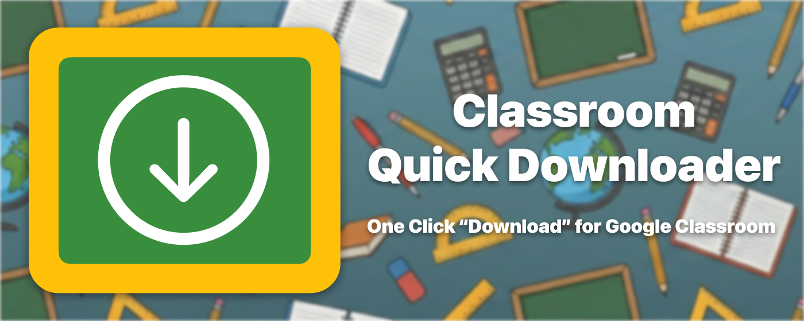
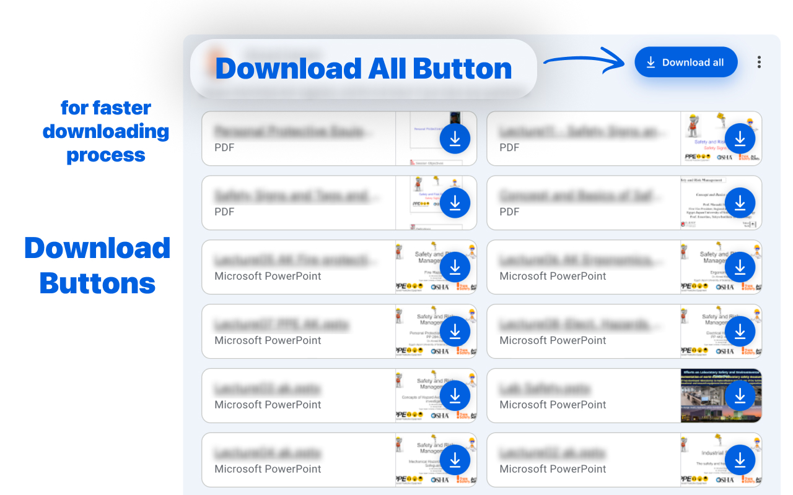
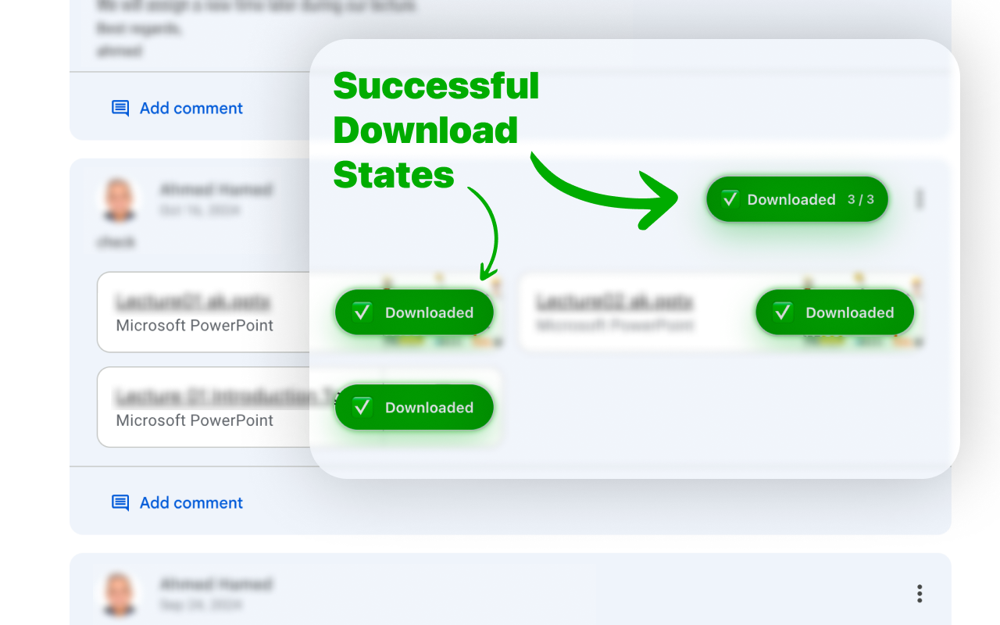
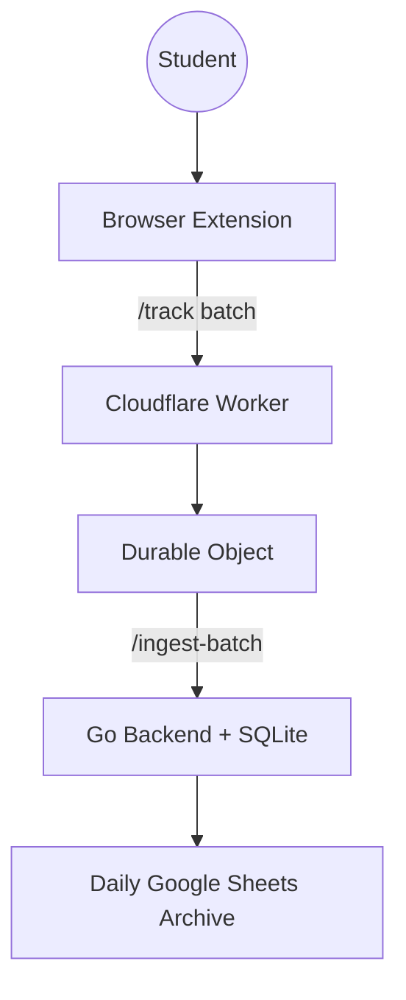

<div align="center">

# 🎓 Classroom Quick Downloader



**Download Google Classroom files in one click instead of one-by-one.**

Built for students who want speed, fewer clicks, and less friction during busy weeks and exam season.

[Install on Chrome](https://chromewebstore.google.com/detail/classroom-quick-downloade/oemoongiefmpmomjikcjmkkkhffcbdid) · [Install on Firefox](https://addons.mozilla.org/en-US/firefox/addon/classroom-quick-downloader/) · [Install on Edge](https://microsoftedge.microsoft.com/addons/detail/classroom-quick-downloade/ecojbijjkcjdolpeoiemnccgmaeomcmn) · [🗺️ Explore the Knowledge Graph](https://adhamhaithameid.github.io/Classroom-Quick-Downloader/)

<!-- Active badge set: Minimal Trust (Set A) -->


[](https://github.com/adhamhaithameid/Classroom-Quick-Downloader/actions/workflows/ci.yml)

</div>

---

<a id="toc"></a>
## 📚 Table of Contents

- [🚀 Why CQD](#why-cqd)
- [✨ Features](#features)
- [🖼️ In Action](#in-action)
- [⚡ How to Use](#how-to-use)
- [🎯 Benefits](#benefits)
- [🛠️ Ops Status](#ops-status)
- [📖 Backstory](#backstory)
- [📦 Installation](#installation)
- [🔒 Privacy at a Glance](#privacy-at-a-glance)
- [❓ FAQ](#faq)
- [🧭 Technical Appendix](#technical-appendix)
- [🧪 Development & Testing](#development--testing)
- [🤝 Feedback](#feedback)
- [⚠️ Licensing & Usage](#licensing)

---

<a id="why-cqd"></a>
## 🚀 Why CQD

Downloading class files one-by-one wastes time and focus. CQD makes the common student workflow faster:

- One-click bulk downloads for assignment materials.
- Less friction around Google Drive confirmation pages.
- Works across Chrome, Firefox, and Edge.
- Built to feel simple for users while staying reliable behind the scenes.

---

<a id="features"></a>
## ✨ Features

- **📦 Bulk Downloads**: Download all files from a Classroom post with one click.
- **🔓 Smart Drive Handling**: Automatically handles Drive confirmation/bypass flows.
- **🧯 Resilient Downloads**: Every download reaches a clear outcome — transient failures retry automatically, stalls time out with guidance, and error pages are never saved as files.
- **🔄 Multi-Account Compatibility**: Better behavior when multiple Google accounts are signed in.
- **📊 Local Activity Stats**: See your own download stats directly in the popup.
- **🛡️ Privacy-First Analytics**: Anonymous operational metrics only, no personal file content.

---

<a id="in-action"></a>
## 🖼️ In Action

### Download Controls in Classroom



### Success State After Download



---

<a id="how-to-use"></a>
## ⚡ How to Use

1. Install CQD from your browser store.
2. Open [Google Classroom](https://classroom.google.com) and go to a post with attachments.
3. Click CQD download controls to start one-click or bulk download.
4. Keep studying instead of manually opening each file.

---

<a id="benefits"></a>
## 🎯 Benefits

- **Saves time during busy periods**: fewer repeated clicks.
- **Reduces manual mistakes**: consistent workflow when many files are involved.
- **Improves reliability**: edge/backend pipeline supports better diagnostics and fixes.
- **Improves continuously**: anonymous telemetry helps prioritize quality improvements across extension + services.

---

<a id="ops-status"></a>
## 🛠️ Ops Status

- Extension release line: `1.8.0` (2026-09-17) — the resilience release: full interrupt taxonomy, stall deadline, completion verification, and an adversarial test program. See the [Changelog](./CHANGELOG.md).
- Security & dependency posture: 2026-09 security quality pass merged (deps updated, CodeQL warnings resolved); latest major scan: [docs/MAJOR_SCAN_2026-03-17.md](docs/MAJOR_SCAN_2026-03-17.md).
- Websites: the marketing site deploys to Cloudflare Pages on every push to `main`, and an interactive codebase knowledge graph deploys to [GitHub Pages](https://adhamhaithameid.github.io/Classroom-Quick-Downloader/).
- Deployment operations: [docs/DEPLOYMENT_RUNBOOK.md](docs/DEPLOYMENT_RUNBOOK.md).

---

<a id="backstory"></a>
## 📖 Backstory: From Lecture Notes to Real Tool

The project started from a simple student pain point: repetitive downloads in Google Classroom.

What began as sketches on paper turned into a production extension used across multiple browsers and operating systems.

> **Repo age**: first commit on November 8, 2025 — about 10 months of active development as of September 2026.

### 📝 The Paper Manifesto

The original system idea started in a university lecture as handwritten architecture notes, then moved into iterative builds and testing. [View the original handwritten system sketch.](docs/readme/handwritten-system-design.jpg)

### 📈 The Evolution

- **V1**: Native JavaScript prototype.
- **Modern CQD**: WXT + React extension with an edge + backend analytics stack.

### 🧪 Validating the Pain

Peer feedback confirmed the same pattern: manual downloading is slow, especially near exams when file volume spikes.

### 🛡️ The Goal

Make downloading class materials boringly easy, so students spend time learning, not clicking.

---

<a id="installation"></a>
## 📦 Installation

### Choose Your Browser

| Browser | Install Link | How to Install |
|---------|--------------|----------------|
| **Chrome** | [Chrome Web Store](https://chromewebstore.google.com/detail/classroom-quick-downloade/oemoongiefmpmomjikcjmkkkhffcbdid) | Click → **Add to Chrome** → **Add Extension** |
| **Firefox** | [Firefox Add-ons](https://addons.mozilla.org/en-US/firefox/addon/classroom-quick-downloader/) | Click → **Add to Firefox** → **Add** |
| **Edge** | [Edge Add-ons](https://microsoftedge.microsoft.com/addons/detail/classroom-quick-downloade/ecojbijjkcjdolpeoiemnccgmaeomcmn) | Click → **Get** → **Add Extension** |

### After Installing

1. Pin the CQD icon in your toolbar.
2. Open [Google Classroom](https://classroom.google.com).
3. Open an assignment/post with files.
4. Use CQD buttons to download faster.

> Want local development setup? See [DEVELOPMENT.md](docs/DEVELOPMENT.md).

---

<a id="privacy-at-a-glance"></a>
## 🔒 Privacy at a Glance

CQD is built to avoid personal tracking.

| ✅ We Collect | ❌ We Never Collect |
|--------------|---------------------|
| File type + status (success/fail/cancelled) | File contents |
| Browser + OS | Names/emails |
| Country-level usage (derived at edge) | Passwords/Google credentials |
| Performance/health metrics | Personal browsing history |

> Full details: [PRIVACY.md](PRIVACY.md)

---

<a id="faq"></a>
## ❓ FAQ

### Does this work only on Google Classroom?
Yes. CQD is intentionally focused on `classroom.google.com` workflows.

### Do you collect my files or account credentials?
No. CQD does not collect file contents, passwords, or personal account identity.

### Is cancellation tracking always perfect?
Cancellation analytics are highly accurate overall, but extremely fast near-cancel actions right after clicking download can be undercounted due to browser timing races.

---

<a id="technical-appendix"></a>
## 🧭 Technical Appendix

CQD is also backed by a distributed reliability pipeline, but the deep engineering docs are split by module for easier reading:

- [Interactive Knowledge Graph (GitHub Pages)](https://adhamhaithameid.github.io/Classroom-Quick-Downloader/) — a live map of the codebase: components, edges, and communities, rebuilt on every push to `main`.
- [Extension Docs](./extension/README.md)
- [Cloudflare Worker Docs](./cloudflare-worker/README.md)
- [Backups & Data Portability](./docs/BACKUPS.md) — daily backup sheet, Google Sheets integration, restore procedures
- [Oracle Backend Docs](./oracle-backend/README.md) — retired from the live data path (see `cloudflare-worker/README.md`)
- [Architecture Overview](./docs/ARCHITECTURE.md)
- [Edge Cache + Oracle Architecture](./docs/ARCHITECTURE_EDGE_CACHE_ORACLE.md) — legacy
- [Website/Edge/Oracle Data Flow](./docs/DATA_FLOW_WEBSITE_EDGE_ORACLE.md) — legacy
- [Manual Changelog Operations](./docs/MANUAL_CHANGELOG_OPERATIONS.md)
- [Oracle Dashboard Dark UI Language](./docs/ORACLE_DASHBOARD_DARK_DESIGN_LANGUAGE.md)
- [Jules Agent Automation](./.github/agents/jules/README.md)
- [Changelog](./CHANGELOG.md)

### High-Level Architecture



### Security Snapshot

- Session-based auth for dashboards.
- Edge-side request controls and rate limits.
- Privacy-first telemetry with non-PII aggregates.

---

<a id="development--testing"></a>
## 🧪 Development & Testing

```bash
pnpm install            # bootstrap the workspace
pnpm run test:gate      # full suite — enforced by a pre-push hook, 100% headless
pnpm run test:e2e:matrix # real-browser cycle: Chromium + Edge + Firefox + Zen
```

Every real-browser suite runs headless by default (set `E2E_HEADED=1` for
visible windows). A pre-push hook runs the complete test pyramid plus the
Chromium and Edge E2E suites before anything reaches the remote. Per-browser
coverage, the local gate, and why branded Chrome and Arc have no automated
legs: [docs/E2E_BROWSER_MATRIX.md](docs/E2E_BROWSER_MATRIX.md).

---

<a id="feedback"></a>
## 🤝 Feedback

Found a bug or want a feature?

- GitHub Issues: [Open an Issue](https://github.com/adhamhaithameid/Classroom-Quick-Downloader/issues)
- Feedback Form: [Submit Feedback](https://docs.google.com/forms/d/1nB95r35O_h98odg8Y6_OrfYdjKGBqhrUCb_wFHA-RA8/edit)

---

<a id="licensing"></a>
## ⚠️ Licensing & Usage

This software is **Proprietary & Source Available**. Copyright © 2025 Adham Haitham. All rights reserved.

- ✅ **You can**: view, read, and use the extension for personal, non-commercial use.
- ❌ **You cannot**: modify, distribute, or build commercial derivatives from this source.

For commercial or licensing inquiries, contact the repository owner.

---

<div align="center">

**Built with ☕ by [Adham Haitham](https://github.com/adhamhaithameid)**

*A productivity extension for students, backed by a reliability-focused data pipeline.*

</div>
