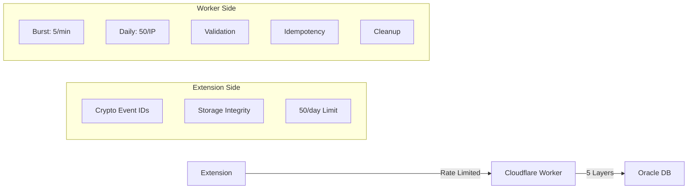

# Security Architecture (Developer Reference)

This document describes the analytics security system for developers.

## Overview

The system implements **defense in depth** with multiple independent security layers. Even if one layer fails, others provide protection.



---

## Worker Security (5 Layers)

### Layer 1: Burst Protection
```typescript
const MAX_BURST_PER_MINUTE = 5;
// Prevents rapid-fire requests from single IP
// Returns: 429 burst_limit_exceeded
```

### Layer 2: Daily Rate Limiting
```typescript
const MAX_PER_IP_DAILY = 50;
// Resets at midnight UTC
// Returns: 429 rate_limit_exceeded
```

### Layer 3: Payload Validation
| Check | Limit | Error |
|-------|-------|-------|
| Events per request | 10 | `too_many_events` |
| Buffer size | 50,000 | `buffer_full` |
| JSON parsing | - | `invalid_json` |

### Layer 4: Robust Idempotency
```typescript
// Event ID format: ext-<timestamp>-<random12chars>
// Validation:
// - ID required, min 10 chars
// - Format must match regex
// - Timestamp within 24h past to 5min future
// - O(1) Set-based deduplication (5000 ID cache)
```

### Layer 5: Automatic Cleanup
- **processedIds**: Trimmed to newest 5000
- **burstCounts**: Entries older than 2 minutes deleted
- Prevents unbounded memory growth

---

## Extension Security

### Cryptographic Event IDs
```typescript
// Uses Web Crypto API when available
crypto.getRandomValues(new Uint8Array(8))
// Format: ext-<timestamp>-<random12chars>
// Worker validates format + timestamp range
```

### Storage Integrity Protection
```typescript
// Checksum-based tamper detection
const checksum = computeChecksum(JSON.stringify(queue));
// Stored alongside queue with count + timestamp
// Warns if checksum mismatch detected
```

### Extension-Side Rate Limiting
```typescript
const MAX_DAILY_REQUESTS = 50;
// Defense in depth - matches worker limit
// Prevents wasted network requests
// Events stay local until tomorrow
```

---

## Error Response Types

| Status | Error | Meaning |
|--------|-------|---------|
| 429 | `burst_limit_exceeded` | >5 requests/minute |
| 429 | `rate_limit_exceeded` | >50 requests/day |
| 400 | `too_many_events` | >10 events in batch |
| 400 | `invalid_json` | Malformed request body |
| 503 | `buffer_full` | Worker buffer at capacity |

---

## Data Flow

1. **Track Event**
   - Generate crypto event ID
   - Save to local storage (LOCAL FIRST)
   - Update local stats
   - Check flush conditions

2. **Flush Attempt**
   - Check extension rate limit (50/day)
   - Check backoff schedule
   - Send batch (max 10 events)

3. **Worker Processing**
   - Layer 1: Burst check
   - Layer 2: Daily limit check
   - Layer 3: Payload validation
   - Layer 4: Idempotency check
   - Process valid events
   - Layer 5: Cleanup

4. **Response Handling**
   - Success: Remove from queue
   - Rate limited: Extended backoff (3x)
   - Other failure: Normal backoff + retry

---

## Security Guarantees

| Threat | Protection |
|--------|------------|
| DoS from single source | 50/day rate limit |
| Burst spam | 5/min burst limit |
| Replay attacks | Idempotency + timestamp validation |
| ID spoofing | Format validation + timestamp range |
| Data tampering | Storage integrity checksum |
| Data loss | LOCAL FIRST + retry queue |

---

## Configuration Constants

### Worker (`downloads_do.ts`)
```typescript
MAX_BURST_PER_MINUTE = 5
MAX_PER_IP_DAILY = 50
MAX_EVENTS_PER_REQUEST = 10
MAX_PROCESSED_IDS = 5000
MAX_EVENT_AGE_MS = 24 hours
MAX_FUTURE_DRIFT_MS = 5 minutes
```

### Extension (`analytics.ts`)
```typescript
MAX_DAILY_REQUESTS = 50
MAX_RETRY = 5
BACKOFF_STEPS = [60, 300, 900, 1800, 3600, 10800, 21600, 43200, 86400]
```

---

## Testing

To test rate limiting:
```bash
# Simulate burst (should fail after 5th request)
for i in {1..10}; do
  curl -X POST https://your-worker.workers.dev/track \
    -H "Content-Type: application/json" \
    -d '{"events":[{"id":"ext-'$(date +%s)'000-abc123def456","status":"success","file_type":"pdf","timestamp":'$(date +%s)'000}]}'
done
```

To reset worker state (admin only):
```bash
curl -X POST https://your-worker.workers.dev/debug/reset \
  -H "Authorization: Bearer YOUR_SECRET"
```
