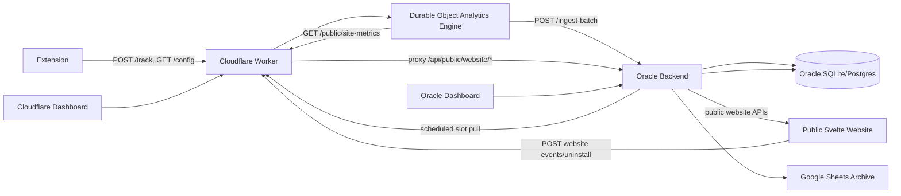
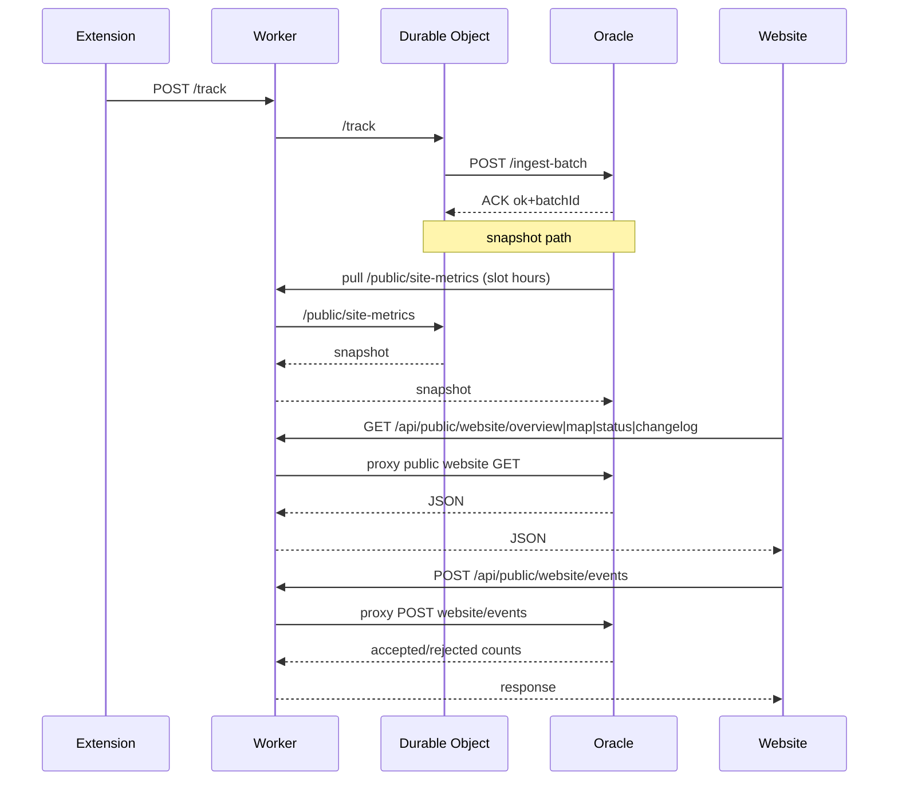

# Full Data Flow Journey (Extension, Worker, Oracle, Website)

This is the end-to-end data journey reference for Classroom Quick Downloader.

It describes:
- every major producer and consumer of data
- where data is transformed, cached, aggregated, and published
- what is currently verified as working
- where risks remain

## 1. System Topology



## 2. Primary Data Domains

1. Download analytics events (extension)
- source: extension runtime
- sink: worker DO buffer, then oracle ingest-batch
- state: aggregated counters, timeseries, health metrics

2. Website behavior telemetry (website)
- source: website nav/CTA/map interactions
- sink: oracle `website_event_daily` via worker gateway
- state: daily aggregated website actions and placement breakdowns

3. Website feedback data
- source: website uninstall feedback page
- sink: `website_uninstall_feedback`
- state: feedback totals, last submission, top reasons

4. Public website snapshot data
- source A: Oracle live totals (`oracle` 1am publish)
- source B: Worker public site metrics (`cloudflare` slot pulls)
- sink: Oracle `website_sync_control` published dataset
- consumer: Oracle public endpoints used by website

## 3. Detailed Journey by Path

### 3.1 Extension -> Worker -> Oracle (core analytics)

Producer:
- extension analytics runtime (`entrypoints/utils/analytics/*`)
- endpoints configured in:
  - `/Users/adhamhaithameid/Desktop/code/Classroom-Quick-Downloader/extension/entrypoints/utils/analytics/constants.ts`

Process:
1. extension queues events locally
2. extension flushes to Worker `POST /track`
3. DO validates + deduplicates + aggregates + buffers
4. DO flushes to Oracle `POST /ingest-batch` with authenticated header
5. Oracle ingests batch and stores aggregates

Reliability:
- extension retries with backoff
- DO pending replay queue for failed oracle flush
- ACK validation on batchId
- midnight flush scheduling and retry alarms

### 3.2 Website -> Worker -> Oracle (public telemetry and feedback)

Producer:
- website interaction tracking:
  - install/download CTA clicks
  - map yes/no prompt actions
  - reinstall clicks from uninstall page

Process:
1. website queues events in localStorage
2. periodic 15s flush or beacon flush on pagehide
3. send `POST /api/public/website/events` to Worker domain
4. Worker proxies to Oracle public events endpoint
5. Oracle validates and upserts daily aggregates with idempotency

Feedback path:
- website submits uninstall feedback to `POST /api/public/website/uninstall`
- Oracle stores structured feedback row

### 3.3 Worker snapshot -> Oracle publish -> Website read

Process:
1. DO exposes sanitized snapshot at `GET /public/site-metrics`
2. Oracle scheduler pulls snapshot at UTC slots: `3, 6, 9, 12, 15, 18, 21`
3. Oracle writes published dataset (`source=cloudflare`) and batch log
4. Oracle public endpoints (`overview`, `map`) return published dataset if active
5. website fetches Oracle public endpoints (usually through Worker gateway) and caches for 3h

### 3.4 Oracle 1am publish path

Process:
1. Oracle scheduled loop runs each minute
2. at `01:00 UTC`, if enabled, publishes live Oracle totals to website published dataset
3. marks source as `oracle`
4. logs `oracle_to_website` sync batch

## 4. Canonical Endpoint Matrix

### Extension/Worker
- `POST /track`
- `GET /config`
- `GET /changelog`
- `GET /pipeline-health`

### Worker public website gateway
- `GET /public/site-metrics`
- `GET /api/public/website/overview`
- `GET /api/public/website/map`
- `GET /api/public/website/status`
- `GET /api/public/website/changelog`
- `GET/POST /api/public/website/uninstall`
- `POST /api/public/website/events`

### Oracle public website
- `GET /api/public/website/overview`
- `GET /api/public/website/map`
- `GET /api/public/website/status`
- `GET /api/public/website/changelog`
- `GET/POST /api/public/website/uninstall`
- `POST /api/public/website/events`

### Oracle website operations/admin
- `GET /api/admin/website/state`
- `GET /api/admin/website/analytics`
- `POST /api/admin/website/force-push`
- `POST /api/admin/website/pull-cloudflare`
- `POST /api/admin/website/override`
- `POST /api/admin/website/one-am-toggle`

## 5. Persistence and Ownership

Oracle tables by responsibility:
- `batches`, `downloads_hourly`, `downloads_totals`: core extension analytics
- `website_event_daily`: website action aggregates
- `website_event_idempotency`: dedupe IDs for website event ingestion
- `website_uninstall_feedback`: feedback submissions
- `website_sync_control`: current published dataset state and switches
- `website_sync_batches`: sync transfer history and diagnostics

## 6. What is Working Now (Verified)

Verified by strict test and scan execution:

1. Endpoints and proxy wiring
- worker allowlist for Oracle public website paths is active
- method gating for uninstall/events routes is enforced

2. Website telemetry ingestion
- website queue/flush path works
- oracle accepts valid event batches, rejects invalid payloads, and deduplicates retries
- partial accept behavior is covered and working

3. Website analytics reporting
- Oracle admin analytics endpoint returns action totals, map yes/no ratios, feedback summaries, daily series, and placement breakdowns

4. Snapshot scheduling and publication
- worker snapshot refresh windows are enforced by slot logic
- oracle slot-pull scheduler and one-am publisher loops are wired and active in server startup

5. Core resilience behaviors
- DO replay queue for failed oracle flush
- ACK mismatch protection
- bounded retries and health signals

6. Test coverage depth (current structure)
- smoke, functional, integration, regression, load, stress, security, UI, fuzz, reliability suites are present across website/worker/oracle package scripts

## 7. Current Issues Found by Scan

Latest repository scan outcome:
- behavior tests pass broadly across website/worker/oracle
- dependency audits report unresolved vulnerabilities:
  - high: `minimatch` advisory range `<10.2.3` in transitive worker tooling chain
  - moderate: `svelte` advisories `<5.53.5` in website package

Practical impact:
- runtime flows are functioning, but supply-chain posture is not yet clean.
- merge/deploy gate should require patched versions and re-scan.

## 8. Security Boundaries

1. Worker as public shield and gateway
- website hits worker domain by default
- worker controls allowed route set and method set

2. Oracle write-route controls
- origin checks for public write endpoints
- strict JSON decoding and payload size limits

3. Admin boundaries
- worker admin paths require session or secret
- oracle admin paths require dashboard auth and step-up for critical operations

4. Public privacy guarantees
- country aggregate only
- no raw IP exposure in public outputs

## 9. Sequence Diagram (Complete Loop)



## 10. Runtime Scheduling Summary

1. Worker DO
- midnight alarm for flush/retry scheduling
- public website snapshot refresh windows:
  - `03:00, 06:00, 09:00, 12:00, 15:00, 18:00, 21:00` UTC

2. Oracle backend
- cloudflare snapshot pull loop at same slot hours, minute window `0..5`
- one-am publisher loop at `01:00` UTC (toggle controlled)
- sheets archiver scheduled separately at `00:15` UTC

3. Website
- snapshot cache refresh interval every `3h`
- event queue flush every `15s` plus beacon on lifecycle events

## 11. Verification Playbook

```bash
# Full strict + security scan
pnpm -C /Users/adhamhaithameid/Desktop/code/Classroom-Quick-Downloader run scan:repo

# Per-package strict
pnpm -C /Users/adhamhaithameid/Desktop/code/Classroom-Quick-Downloader/website run test:strict
pnpm -C /Users/adhamhaithameid/Desktop/code/Classroom-Quick-Downloader/cloudflare-worker run test:strict
pnpm -C /Users/adhamhaithameid/Desktop/code/Classroom-Quick-Downloader/oracle-backend run test:strict
```

Live check shortcuts:

```bash
curl -sS https://cqd-analytics.adhamhaithameid.workers.dev/public/site-metrics | jq .
curl -sS https://cqd-analytics.adhamhaithameid.workers.dev/api/public/website/overview | jq .
curl -sS https://cqd-analytics.adhamhaithameid.workers.dev/api/public/website/map | jq .
```

## 12. Recommended Next Hardening Steps

1. Patch dependency findings
- bump transitive `minimatch` to `>=10.2.3` across lockfile resolution
- bump `svelte` to `>=5.53.5`

2. Add production smoke automation
- scheduled synthetic probes for:
  - `/public/site-metrics`
  - `/api/public/website/overview`
  - website event ingest post

3. Add alerting on stale website sync timestamps
- alert if `lastCloudflarePushAt` or `lastOraclePushAt` exceeds threshold

4. Add deployment gate
- block deploy when `scan:repo` exits non-zero

