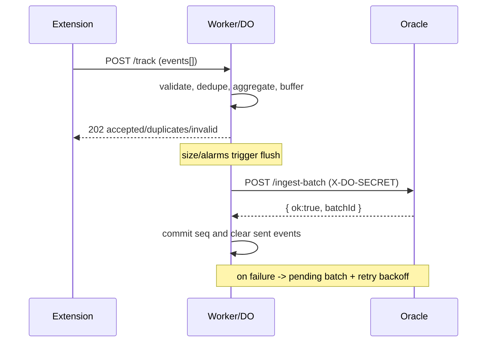
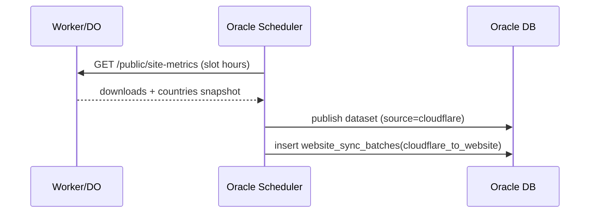

# Oracle <-> Cloudflare Worker Data Flow

This document describes the production data relationship between the Oracle backend and the Cloudflare Worker stack (Worker + Durable Object), including:
- ingestion path from Worker to Oracle
- website metrics sync path from Worker to Oracle
- security boundaries, auth, and CORS
- schedules, retries, idempotency, and failure handling
- operational verification commands

## 1. Scope and Boundaries

Primary components:
- Cloudflare Worker edge router and auth layer:
  - `/Users/adhamhaithameid/Desktop/code/Classroom-Quick-Downloader/cloudflare-worker/src/index.ts`
- Cloudflare Durable Object stateful analytics engine:
  - `/Users/adhamhaithameid/Desktop/code/Classroom-Quick-Downloader/cloudflare-worker/src/downloads_do.ts`
- Oracle HTTP server route wiring:
  - `/Users/adhamhaithameid/Desktop/code/Classroom-Quick-Downloader/oracle-backend/cmd/app/main.go`
- Oracle website/public/admin handlers:
  - `/Users/adhamhaithameid/Desktop/code/Classroom-Quick-Downloader/oracle-backend/internal/handlers/public_website.go`
  - `/Users/adhamhaithameid/Desktop/code/Classroom-Quick-Downloader/oracle-backend/internal/handlers/website_ops.go`
- Oracle persistence:
  - `/Users/adhamhaithameid/Desktop/code/Classroom-Quick-Downloader/oracle-backend/internal/db/db.go`

## 2. Connection Types

There are two independent Oracle/Worker data channels:

1. Analytics ingest channel (high-volume)
- Worker DO flushes event batches to Oracle `POST /ingest-batch`.
- This powers aggregated download analytics and timeseries.

2. Website snapshot channel (public metrics)
- Worker DO publishes sanitized website metrics at `GET /public/site-metrics`.
- Oracle periodically pulls these snapshots and publishes them to website-facing Oracle public endpoints.

## 3. Analytics Ingest Channel (Worker -> Oracle)

### 3.1 Worker ingest endpoint exposed to extension
- Worker public endpoint: `POST /track`
- Implemented in DO fetch router and `handleTrack`:
  - `/Users/adhamhaithameid/Desktop/code/Classroom-Quick-Downloader/cloudflare-worker/src/downloads_do.ts`

Validation and safety controls in DO:
- request body size cap before parse (`5 MB`)
- event count cap per request (`configMaxEventsPerRequest`, default up to `5000`)
- per-event size cap (`10 KB`)
- per-IP rate limit (`120` requests/min default)
- strict status allowlist (`success`, `fail`, `cancelled`)
- idempotency with processed event IDs
- sanitized high-cardinality fields
- client-provided IP is removed before persistence

### 3.2 Flush from DO to Oracle
- DO method: `flushToOracle(...)`
- Target URL resolved from `ORACLE_ENDPOINT` with `/ingest-batch`
- Auth header: `X-DO-SECRET: <DO_SHARED_SECRET>`

ACK integrity checks:
- Oracle response must contain `ok: true`
- ACK `batchId` must exactly match sent batch ID
- mismatch/invalid ACK enters retry path

Retry/failure behavior:
- failed batches move into `pendingBatches`
- exponential backoff retry scheduling
- pending batch replay before new buffered data
- failure rollups and delivery stages tracked

### 3.3 Midnight alarm and retry alarms
- DO schedules midnight UTC alarm (`00:00`) continuously.
- Alarm handler flushes buffer at midnight window and runs retries.
- Health notification logic is evaluated during alarm execution.

## 4. Website Snapshot Channel (Worker -> Oracle)

### 4.1 Worker public snapshot endpoint
- Worker edge route: `GET /public/site-metrics`
  - `/Users/adhamhaithameid/Desktop/code/Classroom-Quick-Downloader/cloudflare-worker/src/index.ts`
- Delegates to DO `GET /public/site-metrics`
  - `/Users/adhamhaithameid/Desktop/code/Classroom-Quick-Downloader/cloudflare-worker/src/downloads_do.ts`

Snapshot data fields:
- `totals.downloads`
- `countries[]` aggregated ISO-2 country counts
- schedule metadata (`refreshHoursUtc`, active hour, next refresh)
- override status and source (`snapshot` vs `override`)

Worker-side cache header:
- `Cache-Control: public, max-age=300, stale-while-revalidate=180`

### 4.2 Worker snapshot refresh schedule
DO refresh windows are fixed UTC hours:
- `3, 6, 9, 12, 15, 18, 21`

If current hour is not in the schedule, snapshot is served without regeneration unless missing.

### 4.3 Oracle pulls Worker snapshot
Oracle scheduled pull loop:
- `StartWebsiteCloudflareSlotPullLoop(...)`
- hours: `3, 6, 9, 12, 15, 18, 21` UTC
- first 5 minutes of each slot accepted (`minute <= 5`)

Manual pull endpoint:
- `POST /api/admin/website/pull-cloudflare`

Pull function:
- `PullWebsiteDatasetFromCloudflare(...)`
- default endpoint fallback:
  - `https://cqd-analytics.adhamhaithameid.workers.dev/public/site-metrics`
- endpoint can be overridden by env:
  - `CLOUDFLARE_PUBLIC_SITE_METRICS_URL`

Persisted sync bookkeeping:
- updates `website_sync_control` published dataset values
- logs batch in `website_sync_batches` with direction `cloudflare_to_website`

## 5. Oracle Publisher Channel (Oracle internal publish)

Oracle also publishes from live Oracle totals directly at 01:00 UTC:
- loop: `StartWebsiteOneAMPublisherLoop(...)`
- gate: `one_am_flush_enabled`
- source marker: `oracle`
- writes into `website_sync_control` and batch logs

Manual force push endpoint:
- `POST /api/admin/website/force-push`

## 6. Route Wiring Summary

### Worker routes relevant to Oracle integration
- `GET /public/site-metrics` -> DO public snapshot
- `POST /track` -> DO ingest
- `/api/public/website/*` -> Oracle proxy gateway routes
- `/admin/website/status|flush-now|override|refresh-toggle` -> protected admin forwarding to DO

### Oracle routes relevant to Worker integration
- `POST /ingest-batch` (DO flush target)
- `GET /api/public/website/overview`
- `GET /api/public/website/map`
- `GET /api/public/website/status`
- `GET /api/public/website/changelog`
- `GET/POST /api/public/website/uninstall`
- `POST /api/public/website/events`
- `GET /api/admin/website/state`
- `GET /api/admin/website/analytics`
- `POST /api/admin/website/force-push`
- `POST /api/admin/website/pull-cloudflare`
- `POST /api/admin/website/override`
- `POST /api/admin/website/one-am-toggle`

## 7. Security Model

### Secrets and trust
Worker env:
- `DO_SHARED_SECRET`
- `ORACLE_ENDPOINT`
- `DASHBOARD_PASSWORD`
- `DANGER_PASSWORD`

Oracle env:
- `DO_SHARED_SECRET` (must match Worker)
- `DASHBOARD_PASSWORD`
- `SUPER_ADMIN_PASSWORD`
- `CLOUDFLARE_PUBLIC_SITE_METRICS_URL`

### Auth boundaries
- Worker admin endpoints require session or `X-Admin-Secret`.
- Worker injects `X-Admin-Secret` when forwarding authorized session admin requests to DO.
- Oracle `ingest-batch` accepts DO authenticated traffic via secret header.

### Public data safety
- country-level aggregation only on public map/snapshot
- no raw IP list in public responses
- unknown or invalid country codes dropped
- deterministic sorting for aggregated country lists

## 8. Reliability and State Durability

### Worker DO reliability controls
- persistent DO state (`analytics_state`)
- pending replay queue (`pendingBatches`) for failed Oracle delivery
- delivery chain metadata and failure rollups
- alarm-driven retries and midnight scheduling

### Oracle sync reliability controls
- control-plane table `website_sync_control`
- batch history table `website_sync_batches`
- website ingest idempotency table `website_event_idempotency`

## 9. Data Model Touchpoints

Oracle tables involved:
- `downloads_totals`
- `website_sync_control`
- `website_sync_batches`
- `website_event_daily`
- `website_event_idempotency`
- `website_uninstall_feedback`

## 10. End-to-End Sequence (Worker -> Oracle)



## 11. End-to-End Sequence (Worker snapshot -> Oracle publish)



## 12. Operational Verification Commands

From repo root:

```bash
pnpm -C cloudflare-worker run test:strict
pnpm -C oracle-backend run test:strict
pnpm run scan:repo
```

Manual endpoint checks:

```bash
# Worker public snapshot
curl -sS https://cqd-analytics.adhamhaithameid.workers.dev/public/site-metrics | jq .

# Oracle public map (through worker proxy if configured that way)
curl -sS https://cqd-analytics.adhamhaithameid.workers.dev/api/public/website/map | jq .
```

## 13. Known Risks and Current Findings

Latest strict scan status:
- functional/integration/reliability suites pass across Worker + Oracle
- dependency audit reports unresolved vulnerabilities:
  - `minimatch` `<10.2.3` advisory chain in worker tooling dependency tree
  - `svelte` `<5.53.5` advisories in website package

Action:
- pin/upgrade to patched ranges and regenerate lockfile, then rerun `pnpm run scan:repo`.

## 14. Troubleshooting Quick Map

1. Worker cannot flush to Oracle
- check `ORACLE_ENDPOINT` and `DO_SHARED_SECRET` in Worker env
- verify Oracle `/ingest-batch` reachable from Worker

2. Oracle cannot pull Cloudflare metrics
- check `CLOUDFLARE_PUBLIC_SITE_METRICS_URL`
- check Worker `/public/site-metrics` returns `ok: true`

3. Public website data stale
- inspect Oracle `/api/admin/website/state`
- verify slot pull loop is running and last batch timestamps advance

4. ACK mismatch errors in Worker logs
- inspect Oracle ACK payload schema
- ensure `batchId` returned unchanged from ingest handler
