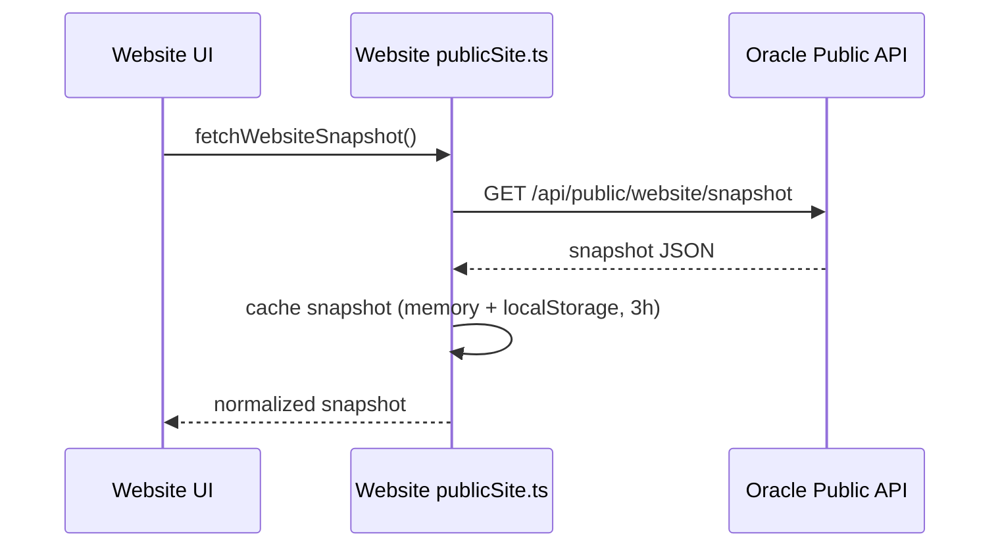
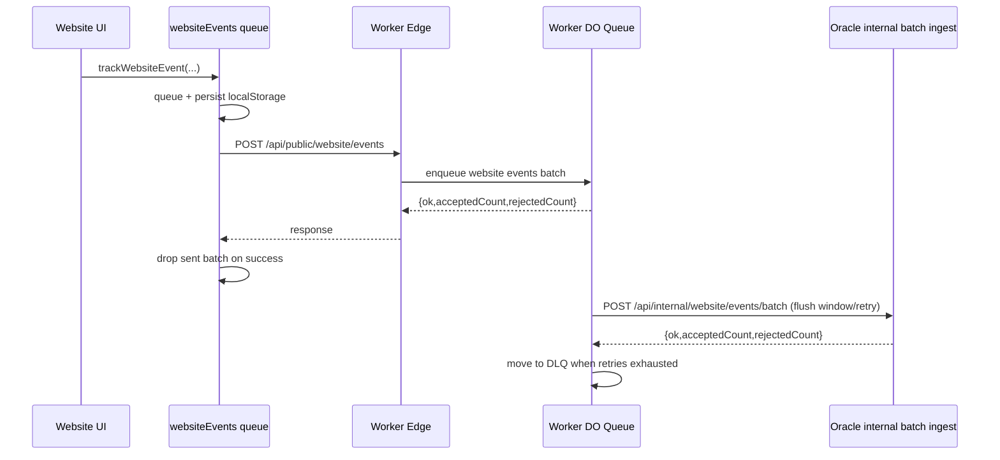

# Worker <-> Website Data Flow

This document explains how the public Svelte website exchanges data with the Cloudflare Worker layer.

It covers:
- read path for website metrics and content
- write path for website telemetry events
- CORS, proxy behavior, and failure handling
- client caching and flush mechanics
- how to validate the link in local and production environments

## 1. Components in this link

Website app:
- `/Users/adhamhaithameid/Desktop/code/Classroom-Quick-Downloader/website`

Website API layer:
- `/Users/adhamhaithameid/Desktop/code/Classroom-Quick-Downloader/website/src/lib/api/publicSite.ts`
- `/Users/adhamhaithameid/Desktop/code/Classroom-Quick-Downloader/website/src/lib/analytics/websiteEvents.ts`
- `/Users/adhamhaithameid/Desktop/code/Classroom-Quick-Downloader/website/src/lib/config.ts`

Worker gateway:
- `/Users/adhamhaithameid/Desktop/code/Classroom-Quick-Downloader/cloudflare-worker/src/index.ts`
- `/Users/adhamhaithameid/Desktop/code/Classroom-Quick-Downloader/cloudflare-worker/src/downloads_do.ts`

## 2. Effective base URL behavior

Website runtime base URLs:
- `ORACLE_API_BASE_URL` from `PUBLIC_ORACLE_API_BASE_URL`
- default fallback points to Worker domain:
  - `https://cqd-analytics.adhamhaithameid.workers.dev`

Result:
- by default, website calls Worker-hosted endpoints even when path names are Oracle paths.

## 3. Website read paths

Website canonical reads are Oracle-targeted:
- `GET /api/public/website/snapshot` (primary)
- compatibility reads from `/api/public/website/*` when needed

Worker is not the canonical read source for website runtime data in this contract.

Website telemetry ingest route remains Worker-only:
- `/api/public/website/events`: `POST` only
- handled by Worker/DO queue ingest path

## 4. Website snapshot cache behavior

`fetchWebsiteSnapshot()` combines overview + map and caches results in two layers:

1. In-memory cache
- shared for the current tab runtime

2. localStorage cache
- key: `cqd.website.snapshot.v1`

Refresh policy:
- `ORACLE_SNAPSHOT_REFRESH_MS = 3h`
- if cache is fresh, no network call
- if a request is already in flight, concurrent callers share the same promise
- on fetch error, stale in-memory snapshot is returned when available

Page refresh loop:
- overview page schedules background reload every 3h in `onMount`.

## 5. Website telemetry write path

### 5.1 Client event queue

Module:
- `website/src/lib/analytics/websiteEvents.ts`

Queue characteristics:
- localStorage key: `cqd.website.events.queue.v1`
- session key: `cqd.website.events.session.v1`
- max queue size: `240`
- max batch per flush: `24`
- periodic flush interval: `15s`

Flush triggers:
- timer-based flush
- immediate flush when batch threshold reached
- `visibilitychange(hidden)` and `pagehide`
- prefers `sendBeacon`; falls back to fetch

### 5.2 Event destination

Website posts telemetry to:
- `POST /api/public/website/events`

In production default, this goes to Worker domain first, then Worker enqueues in Durable Object state.

Queue-first behavior:
- Worker validates payload schema and bounded limits at ingress.
- DO stores queued website telemetry batches and retry metadata.
- Scheduled or manual flush sends internal batch payloads to Oracle.
- Failed retries move batches to DLQ (dead-letter queue).
- Admin replay endpoint (`POST /admin/website/replay-dlq`) requeues failed batches.

### 5.3 Tracked actions currently wired

From layout and pages:
- CTA install clicks (`install_click`)
- CTA download clicks (`download_click`)
- map prompt answer yes/no (`map_yes`, `map_no`)
- reinstall actions from uninstall page (`install_click` with uninstall placements)

Feedback submit itself is posted to:
- `POST /api/public/website/uninstall`

## 6. CORS and browser constraints

Worker CORS behavior for public website routes:
- `Access-Control-Allow-Origin: *`
- allows methods `GET,POST,OPTIONS`
- for Oracle public website routes, allows headers:
  - `Content-Type, X-Requested-With`

Website write requests include:
- `Content-Type: application/json`
- `X-Requested-With: XMLHttpRequest`

For `POST /api/public/website/events` specifically:
- origin must be in `CORS_ALLOWED_ORIGINS`
- Worker returns structured CORS errors when blocked
- Worker then forwards only internal trusted batches to Oracle

## 7. Proxy header forwarding details

When Worker proxies website routes to Oracle, it forwards:
- `content-type`
- `x-requested-with`
- `origin`
- `x-forwarded-for` (from Cloudflare connecting IP)

This is important for Oracle write-route origin checks and auditing.

## 8. Public site metrics endpoint for website snapshots

In addition to Oracle public endpoints, Worker exposes:
- `GET /public/site-metrics`

Returned payload includes:
- downloads
- aggregated country counts
- refresh schedule metadata

Cache policy:
- `public, max-age=300, stale-while-revalidate=180`

## 9. Sequence diagrams

### 9.1 Website data read (Oracle canonical)



### 9.2 Website telemetry write



## 10. What is currently working in this link

Verified from strict tests and current code wiring:
- website public reads route directly to Oracle endpoint
- method-gated proxy prevents invalid verbs
- website telemetry route is queue-first in Worker DO
- website telemetry queue flushes to Oracle internal endpoint with retry + DLQ
- beacon fallback is covered
- snapshot cache is stable and avoids repeated fetches
- map yes/no and CTA tracking are connected
- uninstall submit is routed and validated
- replay endpoint exists for DLQ recovery (`POST /admin/website/replay-dlq`)

## 11. Known issues currently detected

Dependency audit findings from latest scan:
- `minimatch` advisory chain (`<10.2.3`) in worker toolchain dependencies
- `svelte` advisories (`<5.53.5`) in website dependency range

These are package-level risks, not runtime route breakages, but should be patched.

## 12. Verification commands

```bash
# Website contract and behavior
pnpm -C /Users/adhamhaithameid/Desktop/code/Classroom-Quick-Downloader/website run test:strict

# Worker proxy/cors/security behavior
pnpm -C /Users/adhamhaithameid/Desktop/code/Classroom-Quick-Downloader/cloudflare-worker run test:strict

# Combined full scan
pnpm -C /Users/adhamhaithameid/Desktop/code/Classroom-Quick-Downloader run scan:repo
```

Quick endpoint checks:

```bash
curl -sS https://<your-oracle-public-https-domain>/api/public/website/snapshot | jq .
curl -sS https://cqd-analytics.adhamhaithameid.workers.dev/public/site-metrics | jq .
```

## 13. Troubleshooting

1. Website loads but data cards are empty
- verify `PUBLIC_ORACLE_API_BASE_URL` value
- check Oracle health and snapshot endpoint

2. Event counts do not move
- verify browser can call `/api/public/website/events`
- verify Worker queue health:
  - `GET /admin/website/status`
  - `POST /admin/website/flush-now`
  - `POST /admin/website/replay-dlq`
- inspect queue persistence key `cqd.website.events.queue.v1`
- inspect DO queue depth / DLQ count from Worker dashboard

3. CORS errors on website writes
- verify requests include `X-Requested-With`
- verify Worker `CORS_ALLOWED_ORIGINS` includes website origin
- verify Oracle allowlist only for internal/managed write paths as configured

4. Stale values after expected refresh windows
- force refresh using website snapshot force call path
- verify Worker `/public/site-metrics` schedule metadata and snapshot timestamps
