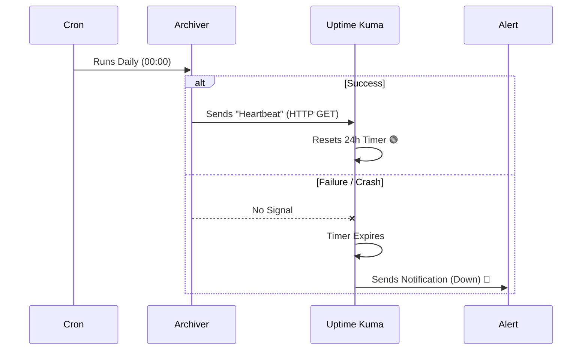

# 🏛️ Oracle Backend & Analytics Engine


The **Oracle Backend** is a high-performance, low-footprint analytics server designed for vertical scaling on ARM architecture (Oracle Cloud Ampere). It serves as the **persistent sink** for the CQD analytics pipeline, receiving batched data from the Cloudflare Worker, storing it in SQLite, and serving a real-time visualization dashboard.

---

## ⚡ Key Features

| Feature | Description |
|---------|-------------|
| **Lightweight** | Single ~15MB binary. No external database server required. |
| **ARM64 Optimized** | Built specifically for Oracle Cloud Free Tier (Ampere A1). |
| **SQLite WAL Mode** | High-performance concurrent reads with Write-Ahead Logging. |
| **Pre-Aggregated Storage** | Receives already-aggregated batches from Cloudflare DO, minimizing write operations. |
| **Google Sheets Archiver** | A separate CLI tool pushes daily snapshots to Google Sheets for long-term reporting. |
| **SPA Dashboard** | Serves a beautiful, embedded analytics dashboard with no external dependencies. |

---

## 🏗️ System Architecture

```
┌─────────────────────────────────────────────────────────────────────────────┐
│                        CLOUDFLARE DURABLE OBJECT                            │
│                   (Buffers events, aggregates batches)                      │
└────────────────────────────────┬────────────────────────────────────────────┘
                                 │
                                 │  POST /ingest-batch
                                 │  Header: X-DO-SECRET
                                 ▼
┌─────────────────────────────────────────────────────────────────────────────┐
│                         ORACLE BACKEND (This Server)                        │
│                         ────────────────────────────                        │
│                                                                             │
│   ┌─────────────────────────────────────────────────────────────────────┐   │
│   │                        HTTP SERVER (:8080)                          │   │
│   │   ┌───────────────┐   ┌───────────────┐   ┌───────────────────┐    │   │
│   │   │  /ingest-batch│   │  /api/stats/* │   │   Static Files    │    │   │
│   │   │  (Write)      │   │  (Read)       │   │   (Dashboard SPA) │    │   │
│   │   └───────┬───────┘   └───────┬───────┘   └───────────────────┘    │   │
│   │           │                   │                                     │   │
│   └───────────┼───────────────────┼─────────────────────────────────────┘   │
│               │                   │                                         │
│               ▼                   ▼                                         │
│   ┌─────────────────────────────────────────────────────────────────────┐   │
│   │                   SQLite Database (WAL Mode)                        │   │
│   │   ┌─────────────┐  ┌──────────────────┐  ┌────────────────────┐    │   │
│   │   │   batches   │  │ downloads_hourly │  │  downloads_totals  │    │   │
│   │   │ (raw logs)  │  │ (time-series)    │  │  (fast counters)   │    │   │
│   │   └─────────────┘  └──────────────────┘  └────────────────────┘    │   │
│   └─────────────────────────────────────────────────────────────────────┘   │
│                                                                             │
└─────────────────────────────────────────────────────────────────────────────┘
                                 │
                                 │  Cron Job (Daily)
                                 ▼
┌─────────────────────────────────────────────────────────────────────────────┐
│                         ARCHIVER CLI TOOL                                   │
│   1. Fetches /api/stats/summary from local server                           │
│   2. Transforms data to spreadsheet rows                                    │
│   3. Appends to Google Sheet via Service Account                            │
└─────────────────────────────────────────────────────────────────────────────┘
```

### The Server

The HTTP server (`cmd/app/main.go`) listens on port `8080` and provides:
- **Ingestion Endpoint**: `POST /ingest-batch` receives aggregated batches from Cloudflare.
- **Analytics API**: `GET /api/stats/*` endpoints power the frontend dashboard.
- **Static File Server**: Serves the SPA dashboard from `/static`.

### The Database

SQLite is configured with **WAL (Write-Ahead Logging)** mode for optimal concurrent read performance:
- No external database server required.
- Single-file database simplifies backups and deployment.
- `busy_timeout=5000` prevents lock contention errors.
- Connection pooling: 1 writer, multiple readers.

### The Archiver

A separate binary (`cmd/archiver/main.go`) connects to the local API and pushes a daily snapshot to Google Sheets. This is scheduled via cron and uses a Google Cloud Service Account for authentication.

---

## 📁 Project Structure

```
oracle-backend/
├── cmd/
│   ├── app/
│   │   └── main.go           # HTTP server entry point
│   └── archiver/
│       └── main.go           # Google Sheets archiver CLI
├── internal/
│   ├── db/
│   │   └── db.go             # SQLite initialization, migrations, schema
│   ├── handlers/
│   │   ├── health.go         # Health check endpoints
│   │   ├── store_batch.go    # POST /ingest-batch handler
│   │   └── stats.go          # Analytics API handlers
│   └── model/
│       └── types.go          # Shared type definitions
├── static/
│   ├── index.html            # SPA dashboard (embedded)
│   ├── logo.svg              # CQD branding
│   └── favicon.png           # Browser favicon
├── Dockerfile                # Multi-stage production build
├── docker-compose.yml        # Deployment configuration
├── deploy.sh                 # One-liner deploy script
├── go.mod                    # Go module dependencies
└── README.md                 # You are here! 📍
```

| Directory/File | Purpose |
|----------------|---------|
| `cmd/app/` | Main HTTP server binary. Starts server, registers routes, serves static files. |
| `cmd/archiver/` | CLI tool for daily Google Sheets export. |
| `internal/db/` | Database initialization, schema migrations, SQLite config. |
| `internal/handlers/` | HTTP handler logic for ingestion and analytics APIs. |
| `static/` | Pre-built dashboard SPA (served by the Go server). |
| `Dockerfile` | Multi-stage build for minimal production image. |
| `docker-compose.yml` | Docker Compose service definition for deployment. |
| `deploy.sh` | Helper script for rebuilding and restarting the container. |

---

## ⚙️ Configuration & Environment

All configuration is done via environment variables, defined in `docker-compose.yml`:

| Variable | Default | Description |
|----------|---------|-------------|
| `ADDR` | `:8080` | Address and port to listen on. |
| `DB_PATH` | `/data/analytics.db` | Path to the SQLite database file. |
| `STATIC_DIR` | `/app/static` | Directory containing dashboard static files. |
| `DO_SHARED_SECRET` | *(required)* | Shared secret for authenticating Cloudflare Durable Object requests. |

### 🔐 Setting `DO_SHARED_SECRET`

> **⚠️ WARNING: Never commit secrets to version control.**

The `DO_SHARED_SECRET` is used to authenticate requests from the Cloudflare Worker. It **must match** the secret configured in the Worker's `wrangler.toml`.

**Option 1: Environment Variable (Recommended)**
```bash
export DO_SHARED_SECRET="$(openssl rand -hex 32)"
docker compose up -d
```

**Option 2: `.env` File**
```bash
# Create .env file (add to .gitignore!)
echo "DO_SHARED_SECRET=$(openssl rand -hex 32)" > .env
docker compose up -d
```

### 🔑 Google Credentials

The archiver requires a Google Cloud Service Account JSON file for Google Sheets API access.

> **⚠️ WARNING: Never commit `google-credentials.json` to version control.**

1. Create a Service Account in Google Cloud Console.
2. Enable the Google Sheets API.
3. Download the JSON key file.
4. Place it at `oracle-backend/google-credentials.json`.
5. Share your Google Sheet with the Service Account email.

The file is mounted read-only in the container via `docker-compose.yml`:
```yaml
volumes:
  - ./google-credentials.json:/app/google-credentials.json:ro
```

---

## 📡 API Documentation

### `POST /ingest-batch` — Ingest Aggregated Batch

The primary endpoint called by the Cloudflare Durable Object. Receives pre-aggregated analytics data.

**Authentication:** Requires `X-DO-SECRET` header matching `DO_SHARED_SECRET`.

**Request:**
```bash
curl -X POST http://localhost:8080/ingest-batch \
  -H "Content-Type: application/json" \
  -H "X-DO-SECRET: your-shared-secret" \
  -d '{
    "batchId": "do-seq15-500ev",
    "generatedAt": 1702732800000,
    "timeZone": "UTC",
    "summary": { ... },
    "timeBuckets": [ ... ],
    "doState": { ... }
  }'
```

**Response:**
```json
{ "ok": true, "message": "ingested" }
```

**Idempotency:** If a `batchId` already exists, the request is silently ignored (returns success without duplicating data).

---

### `GET /api/stats/summary` — Full Summary

Returns complete analytics summary including totals, breakdowns, and top stats. Used by both the dashboard and the archiver.

**Request:**
```bash
curl http://localhost:8080/api/stats/summary
```

**Response:**
```json
{
  "ok": true,
  "generatedAt": 1702732800000,
  "status": "online",
  "flags": ["remote_enabled"],
  "totalDownloads": 12500,
  "totalSuccess": 11800,
  "totalFail": 700,
  "successRate": 0.944,
  "browsers": { "chrome": 9000, "firefox": 2500, "edge": 1000 },
  "os": { "windows": 7000, "macos": 4000, "linux": 1500 },
  "countries": { "eg": 5000, "us": 3000, "sa": 2000 },
  "topBrowser": "chrome",
  "topOs": "windows",
  "topCountry": "eg",
  "topType": "pdf"
}
```

---

### `GET /api/stats/timeseries` — Time-Series Data

Returns download counts over time for charting.

**Parameters:**
| Param | Default | Description |
|-------|---------|-------------|
| `granularity` | `day` | `hour` or `day` |
| `from` | 7 days ago | Start date (YYYY-MM-DD) |
| `to` | today | End date (YYYY-MM-DD) |

**Request:**
```bash
curl "http://localhost:8080/api/stats/timeseries?granularity=day&from=2024-12-01&to=2024-12-15"
```

---

### `GET /api/stats/breakdown` — Dimension Breakdown

Returns counts grouped by a specific dimension.

**Parameters:**
| Param | Default | Options |
|-------|---------|---------|
| `dimension` | `type` | `type`, `browser`, `os`, `country`, `language`, `version`, `error` |
| `from` / `to` | Last 7 days | Date range |

**Request:**
```bash
curl "http://localhost:8080/api/stats/breakdown?dimension=country&from=2024-12-01"
```

---

### `GET /api/stats/comparison` — Period Comparison

Compares two time periods for trend analysis.

**Request:**
```bash
curl "http://localhost:8080/api/stats/comparison?from1=2024-12-01&to1=2024-12-07&from2=2024-12-08&to2=2024-12-14"
```

---

### `GET /api/stats/export` — Export Data

Exports time-series data as JSON or CSV.

**Parameters:**
| Param | Default | Description |
|-------|---------|-------------|
| `format` | `json` | `json` or `csv` |
| `granularity` | `day` | `hour` or `day` |

**Request:**
```bash
# CSV download
curl "http://localhost:8080/api/stats/export?format=csv&from=2024-12-01" -o analytics.csv
```

---

### `GET /health` — Health Check

Simple health probe for Docker health checks and load balancers.

**Request:**
```bash
curl http://localhost:8080/health
```

**Response:**
```json
{ "ok": true }
```

---

## 📊 Google Sheets Archiver

The `archiver` CLI tool pushes daily analytics snapshots to a Google Sheet for long-term historical tracking.

### How It Works

1. Fetches `/api/stats/summary` from the local server.
2. Extracts totals, breakdowns, and top stats.
3. Formats data as a spreadsheet row.
4. Appends the row to the specified Google Sheet.

### Usage

```bash
./archiver \
  --sheet "YOUR_GOOGLE_SHEET_ID" \
  --creds "/app/google-credentials.json" \
  --api "http://localhost:8080/api/stats/summary"
```

### Cron Job Setup

To run the archiver daily at midnight UTC:

```bash
# Edit crontab
crontab -e

# Add this line
0 0 * * * docker exec cqd-oracle-backend /app/archiver --sheet "YOUR_SHEET_ID" >> /var/log/archiver.log 2>&1
```

### Google Sheet Columns

The archiver appends a row with the following columns:

| Column | Data |
|--------|------|
| A | Date |
| B | Total Downloads |
| C | Total Success |
| D | Total Fail |
| E | Success Rate (%) |
| F | Top Browser |
| G | Top OS |
| H | Top Country |
| I | Top File Type |
| J | All Browsers (breakdown) |
| K | All OS (breakdown) |
| L | All Countries (breakdown) |
| M | All Languages (breakdown) |
| N | All File Types (breakdown) |
| O | All Errors (breakdown) |
| P | Extension Versions (breakdown) |

---

## 🗄️ Database Schema

The SQLite database contains four main tables:

### `batches` — Batch Metadata

Stores metadata for each ingested batch. Used for idempotency (deduplication by `batch_id`).

```sql
CREATE TABLE batches (
  batch_id        TEXT PRIMARY KEY,
  generated_at    INTEGER,
  ingested_at     INTEGER,
  time_zone       TEXT,
  events_count    INTEGER,
  downloads_count INTEGER,
  success_count   INTEGER,
  fail_count      INTEGER
);
```

### `downloads_hourly` — Time-Series Data

Stores per-hour aggregated metrics. Each row represents one hour of data from one batch.

```sql
CREATE TABLE downloads_hourly (
  id                   INTEGER PRIMARY KEY AUTOINCREMENT,
  bucket_start         TEXT NOT NULL,
  bucket_end           TEXT NOT NULL,
  total_events         INTEGER NOT NULL DEFAULT 0,
  total_downloads      INTEGER NOT NULL DEFAULT 0,
  total_success        INTEGER NOT NULL DEFAULT 0,
  total_fail           INTEGER NOT NULL DEFAULT 0,
  by_status_json       TEXT,
  by_type_json         TEXT,
  by_browser_json      TEXT,
  by_os_json           TEXT,
  by_ext_ver_json      TEXT,
  by_lang_json         TEXT,
  by_country_json      TEXT,
  by_error_type_json   TEXT,
  batch_id             TEXT NOT NULL
);
```

### `downloads_totals` — Fast Counters

Key-value store for lifetime totals. Enables O(1) lookup for summary queries.

```sql
CREATE TABLE downloads_totals (
  key   TEXT PRIMARY KEY,
  value INTEGER NOT NULL DEFAULT 0
);
```

Key patterns:
- `totalEvents`, `totalDownloads`, `totalSuccess`, `totalFail`
- `browser:chrome`, `browser:firefox`, ...
- `os:windows`, `os:macos`, ...
- `country:eg`, `country:us`, ...

### `do_state_snapshots` — Durable Object Health History

Stores DO state snapshots included in each batch for observability.

```sql
CREATE TABLE do_state_snapshots (
  snapshot_id           INTEGER PRIMARY KEY AUTOINCREMENT,
  captured_at           INTEGER NOT NULL,
  source                TEXT NOT NULL,
  raw_json              TEXT,
  total_events          INTEGER,
  pending_events        INTEGER,
  requests_today        INTEGER,
  quota_level           TEXT,
  -- ... more fields
);
```

---

## 🚀 Deployment (Oracle Cloud / Docker)

### Prerequisites

- Docker 20.10+
- Docker Compose v2+
- ARM64 server (Oracle Cloud Ampere A1 recommended)

### Building the Image

The Dockerfile uses a multi-stage build for a minimal production image:

```bash
# Build for ARM64 (default)
docker build -t cqd-oracle-backend .

# Build for AMD64 (if needed)
docker build --build-arg TARGETARCH=amd64 -t cqd-oracle-backend .
```

### Running with Docker Compose

```bash
# Set the shared secret
export DO_SHARED_SECRET="your-strong-secret"

# Start the service
docker compose up -d

# View logs
docker compose logs -f oracle-backend
```

### Using `deploy.sh`

For quick redeploys after code changes:

```bash
./deploy.sh
```

This script:
1. Rebuilds the Docker image.
2. Restarts the container.
3. Prunes unused images.
4. Shows recent logs.

### Data Persistence

SQLite data is persisted in a Docker volume:
```yaml
volumes:
  - oracle_data:/data
```

To backup the database:
```bash
docker cp cqd-oracle-backend:/data/analytics.db ./backup-$(date +%Y%m%d).db
```

---

## 📡 System Monitoring & Alerting

We use **Uptime Kuma** for self-hosted infrastructure monitoring. It runs on the same Oracle VM as the backend, providing 24/7 uptime tracking and instant alerts when something goes wrong.

### Tooling

| Component | Details |
|-----------|---------|
| **Software** | [Uptime Kuma](https://github.com/louislam/uptime-kuma) |
| **Deployment** | Docker container on Oracle VM |
| **Port** | `3001` |

### Monitors

We monitor three critical components of the CQD analytics pipeline:

| Monitor | Type | Endpoint | Purpose |
|---------|------|----------|---------|
| **Cloudflare Edge** | HTTP(S) | `https://cqd-analytics.*.workers.dev/health` | Verifies the Worker is responding and can route requests to the Durable Object |
| **Backend API** | HTTP | `GET /health` | Checks the Go server is running and accepting connections |
| **SQLite Database** | HTTP | `GET /health/db` | Verifies database read access and checks for lock contention issues |

### Cron Monitoring (Push Monitor)

The `archive-stats` tool uses a **Push Monitor** to "call home" after each successful run:

```
┌────────────────────────────────────────────────────────────────┐
│                         CRON JOB                               │
│   0 0 * * * /app/archiver --sheet "..." && curl <push-url>    │
└──────────────────────────────┬─────────────────────────────────┘
                               │
                               ▼ (on success)
┌────────────────────────────────────────────────────────────────┐
│                      UPTIME KUMA                               │
│   Push Monitor expects a "heartbeat" within 24h + grace period │
│   If no heartbeat → Alert triggered!                           │
└────────────────────────────────────────────────────────────────┘
```

**How it works:**
1. The cron job runs the archiver tool daily.
2. If the archiver succeeds, it curls the Uptime Kuma push URL.
3. If no heartbeat is received within the expected window (24 hours + configurable grace period), Kuma sends an alert.
4. This catches silent failures like: cron not running, archiver crashes, network issues, or Google Sheets API errors.

**Cron Monitoring Flow:**



### Deployment

Start the monitoring container with Docker:

```bash
docker run -d \
  --restart=always \
  -p 3001:3001 \
  -v uptime-kuma:/app/data \
  --name uptime-kuma \
  louislam/uptime-kuma:latest
```

**Key flags:**
- `--restart=always` — Auto-restart on VM reboot
- `-v uptime-kuma:/app/data` — Persist configuration and history
- `-p 3001:3001` — Expose web dashboard

### Public Status Page

A public status page is available for users to check system health without authentication:

```
http://<your-vm-ip>:3001/status/cqd
```

This page shows:
- Current status of all monitors (up/down)
- Uptime percentages (24h, 7d, 30d)
- Incident history

> **Tip:** Share this status page URL in your extension's support documentation so users can self-diagnose outage issues.

---

## 🚨 Troubleshooting

### 401 Unauthorized on `/ingest-batch`

**Symptom:** Cloudflare Worker receives `401 Unauthorized` when flushing to Oracle.

**Cause:** `X-DO-SECRET` header doesn't match `DO_SHARED_SECRET`.

**Solution:**
1. Verify `DO_SHARED_SECRET` in `docker-compose.yml` or environment.
2. Ensure the same secret is set in Cloudflare Worker's `wrangler secret put DO_SHARED_SECRET`.
3. Restart both services after changing secrets.

---

### Database Locked Errors

**Symptom:** Logs show `database is locked`.

**Cause:** WAL mode corruption or concurrent writes from multiple processes.

**Solution:**
1. Ensure only one `oracle-backend` process is running.
2. Verify `DB_PATH` points to the same file for all operations.
3. If persists, restart the container.

---

### Archiver Fails with "Unable to read client secret file"

**Symptom:** Archiver can't find `google-credentials.json`.

**Cause:** File not mounted or incorrect path.

**Solution:**
1. Verify `google-credentials.json` exists in `oracle-backend/`.
2. Check `docker-compose.yml` volume mount is correct.
3. Ensure Service Account has Sheets API enabled.

---

### Container Fails Health Check

**Symptom:** Docker marks container as unhealthy.

**Cause:** Server isn't responding to `/health` within 3 seconds.

**Solution:**
1. Check logs: `docker compose logs oracle-backend`.
2. Verify port `8080` is not in use by another process.
3. Ensure `DB_PATH` directory is writable.

---

## 📄 License

This project is part of the Classroom Quick Downloader suite. See the main repository for licensing details.
